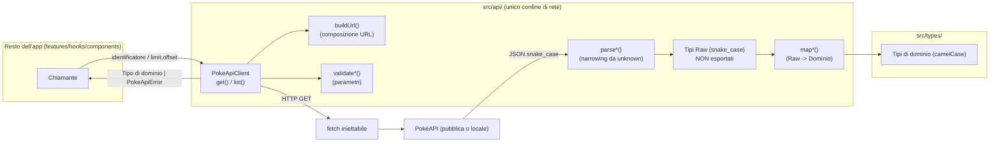
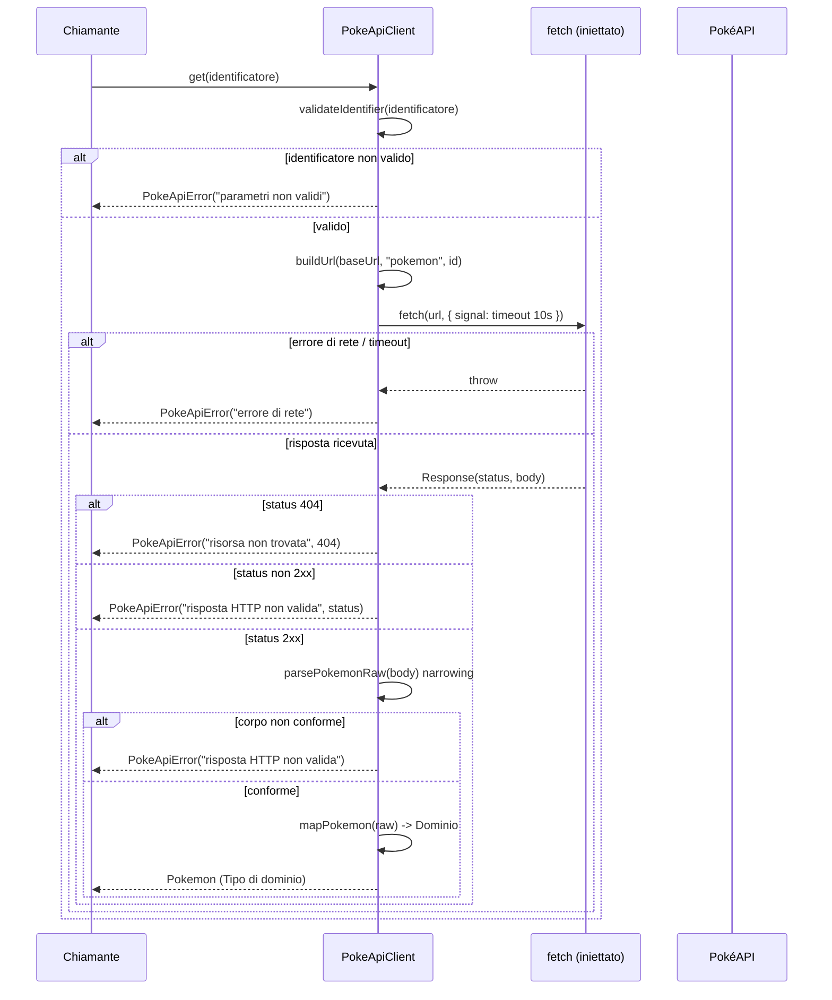

# Design Document

## Overview

Questa feature introduce un **client per le PokéAPI** confinato nel livello
`src/api/`. Il client espone due operazioni di sola lettura:

- **`get(identificatore)`** — recupera una singola risorsa (un Pokémon) per id
  numerico o per nome (Requirement 1).
- **`list({ limit, offset })`** — recupera un elenco paginato di riferimenti a
  risorse (Requirement 2).

Il client è l'unico punto dell'applicazione che conosce l'URL e la **forma
grezza** (snake_case) delle PokéAPI. Verso l'esterno espone soltanto **tipi di
dominio** nostri (camelCase), definiti in `src/types/` (Requirement 5). Il Base
URL è configurabile e ha come default l'endpoint pubblico
`https://pokeapi.co/api/v2/`; può essere sostituito con quello di un'istanza
PokéAPI locale (Requirement 3, Requirement 6).

La funzione `fetch` è **iniettabile** (dependency injection): questo rende gli
unit test deterministici, senza rete reale (Requirement 6). I fallimenti sono
segnalati con un tipo `PokeApiError` a **categoria discriminata** e messaggio in
italiano (Requirement 4).

### Fatti sulle PokéAPI (verificati)

- Base URL pubblico: `https://pokeapi.co/api/v2/`. REST, sola lettura (GET),
  nessuna autenticazione.
- `GET /pokemon?limit=&offset=` →
  `{ count: number, next: string | null, previous: string | null, results: Array<{ name: string, url: string }> }`.
- `GET /pokemon/{id|name}` → oggetto con `id`, `name`, `height`, `weight`,
  `base_experience`, `abilities[]`, `types[]`, `sprites`, ecc. La risposta usa
  **snake_case** (es. `base_experience`), da mappare in camelCase nel dominio
  (`baseExperience`).
- Il filtro `q` per nome è supportato solo su installazioni locali (fuori scope
  di base).
- L'istanza self-hosted (repo `PokeAPI/pokeapi` via Docker Compose) espone lo
  stesso contratto REST: puntandovi il Base URL, il comportamento osservabile è
  identico (Requirement 6.3).

Fonti: [documentazione PokéAPI v2](https://pokeapi.co/docs/v2) e
[repository PokeAPI/pokeapi](https://github.com/PokeAPI/pokeapi).
Contenuti rielaborati per conformità con le restrizioni di licenza.

## Architecture

### Confini e responsabilità

Il livello `src/api/` è l'unica frontiera che conosce la rete. La regola di
confine dello steering (`structure.md`) è rispettata così:

- `src/api/` conosce URL, query string e **tipi Raw** (snake_case). I tipi Raw
  **non** vengono esportati fuori da `src/api/` (Requirement 5.3).
- `src/types/` contiene i **tipi di dominio** condivisi (camelCase).
- Le funzioni pure (composizione URL, validazione, mapping, narrowing) vivono in
  `src/api/` e sono testabili in isolamento, senza rete.



### Flusso di una richiesta (happy path e errori)



### Decisione: eccezioni vs Result type

**Scelta: un `Result` type discriminato** (`{ ok: true; value } | { ok: false; error: PokeApiError }`)
come tipo di ritorno delle operazioni pubbliche `get`/`list`.

Motivazione:

- I requisiti dicono ripetutamente che il client **SHALL restituire un
  PokeApiError** (Requirement 1.4–1.7, 2.5–2.7, 4.x): un valore di errore
  restituito modella questa formulazione meglio di un'eccezione lanciata.
- Rende l'errore **parte del tipo**: il chiamante è obbligato dal compilatore
  (TypeScript strict) a discriminare `ok` prima di accedere al valore, evitando
  stati di errore non gestiti nell'interfaccia (Requirement 4).
- È deterministico e facile da testare per proprietà, senza `try/catch`.

**Eccezione alla regola:** la *creazione* del client con Base URL non valido
**solleva** un errore (`throw`), perché il Requirement 3.4 richiede
esplicitamente di "rifiutare la creazione ... senza creare un'istanza
utilizzabile". Un costruttore non può restituire un `Result`, quindi in quel
solo punto usiamo un'eccezione (`PokeApiConfigError`).

### Timeout

Ogni richiesta usa un `AbortController` con timeout di 10 secondi
(Requirement 1.7, 4.3). Allo scadere, l'abort provoca il rigetto della
`fetch`, che viene catturato e tradotto in un `PokeApiError` di categoria
"errore di rete".

## Components and Interfaces

Tutti i file stanno accanto ai rispettivi test (`*.test.ts`), secondo
`structure.md`.

```
src/
├── api/
│   ├── pokeApiClient.ts          # createPokeApiClient + get/list
│   ├── pokeApiClient.test.ts
│   ├── raw.ts                    # Tipi Raw (snake_case) NON esportati fuori
│   ├── parse.ts                  # narrowing da unknown -> Raw
│   ├── parse.test.ts
│   ├── mappers.ts                # Raw -> Tipi di dominio (funzioni pure)
│   ├── mappers.test.ts
│   ├── url.ts                    # buildUrl + query string (funzioni pure)
│   ├── url.test.ts
│   ├── validation.ts             # validazione identificatore/paginazione/baseUrl
│   ├── validation.test.ts
│   └── errors.ts                 # PokeApiError, PokeApiConfigError, Result
└── types/
    └── pokemon.ts                # Tipi di dominio condivisi (camelCase)
```

### Interfaccia pubblica del client

```typescript
// src/api/pokeApiClient.ts
import type { Pokemon, PokemonListPage } from '../types/pokemon';
import type { Result } from './errors';

/** Firma della funzione fetch iniettabile (sottoinsieme di quella del DOM). */
export type FetchFn = (
  input: string,
  init?: { signal?: AbortSignal },
) => Promise<FetchResponse>;

/** Sottoinsieme di Response effettivamente consumato dal client. */
export interface FetchResponse {
  readonly ok: boolean;
  readonly status: number;
  json(): Promise<unknown>;
}

export interface PokeApiClientOptions {
  /** Default: 'https://pokeapi.co/api/v2/'. */
  readonly baseUrl?: string;
  /** Default: globalThis.fetch adattato. Iniettabile per i test. */
  readonly fetchFn?: FetchFn;
  /** Timeout in millisecondi. Default: 10_000. */
  readonly timeoutMs?: number;
}

export interface ListParams {
  /** Intero 1..100. Default: 20. */
  readonly limit?: number;
  /** Intero >= 0. Default: 0. */
  readonly offset?: number;
}

export interface PokeApiClient {
  get(identifier: string | number): Promise<Result<Pokemon>>;
  list(params?: ListParams): Promise<Result<PokemonListPage>>;
}

/**
 * Crea un client. Solleva PokeApiConfigError se baseUrl non è un URL assoluto
 * http(s) valido (Requirement 3.4).
 */
export function createPokeApiClient(
  options?: PokeApiClientOptions,
): PokeApiClient;
```

Nota: `FetchResponse` è un sottoinsieme volutamente minimale di `Response` del
DOM: consente di iniettare mock semplici nei test senza costruire una
`Response` completa, e mantiene i confini tipizzati senza `any`
(Requirement 5.6, 6.1).

### Composizione URL (funzioni pure)

```typescript
// src/api/url.ts

/**
 * Unisce baseUrl e segmenti con esattamente un singolo '/' tra le parti,
 * indipendentemente da '/' finali/iniziali (Requirement 3.3).
 */
export function buildUrl(baseUrl: string, ...segments: string[]): string;

/** Serializza i parametri di query in modo deterministico e ordinato. */
export function buildQuery(params: Record<string, string | number>): string;
```

### Validazione (funzioni pure)

```typescript
// src/api/validation.ts
import type { PokeApiError } from './errors';

/** Requirement 1.1, 1.2, 1.5. Normalizza le stringhe in minuscolo. */
export function validateIdentifier(
  identifier: string | number,
): Result<string, PokeApiError>;

/** Requirement 2.4, 2.5. Applica i default e valida i range. */
export function validatePagination(
  params?: ListParams,
): Result<{ limit: number; offset: number }, PokeApiError>;

/** Requirement 3.4. true se baseUrl è un URL assoluto http(s) con host. */
export function isValidBaseUrl(baseUrl: string): boolean;
```

`Result` è generalizzato con un secondo parametro per l'errore (default
`PokeApiError`), così le funzioni interne possono riusarlo.

### Parsing/narrowing difensivo (da `unknown`)

```typescript
// src/api/parse.ts
import type { PokemonRaw, PokemonListPageRaw } from './raw';

/** Restituisce il Raw se il corpo è conforme, altrimenti null. Niente any. */
export function parsePokemonRaw(body: unknown): PokemonRaw | null;
export function parseListPageRaw(body: unknown): PokemonListPageRaw | null;
```

Il narrowing parte da `unknown` (non `any`) e verifica presenza e tipo di ogni
campo consumato prima di trattarlo come `Raw` (Requirement 5.1, 5.5, 5.6).

### Mapping Raw → Dominio (funzioni pure)

```typescript
// src/api/mappers.ts
import type { PokemonRaw, PokemonListPageRaw } from './raw';
import type { Pokemon, PokemonListPage } from '../types/pokemon';

export function mapPokemon(raw: PokemonRaw): Pokemon;
export function mapListPage(raw: PokemonListPageRaw): PokemonListPage;
```

## Data Models

### Tipi Raw (snake_case) — confinati in `src/api/raw.ts`, NON esportati fuori

Tipizzano soltanto i campi effettivamente consumati (Requirement 5.1).

```typescript
// src/api/raw.ts
export interface PokemonRaw {
  readonly id: number;
  readonly name: string;
  readonly height: number;
  readonly weight: number;
  readonly base_experience: number;
  readonly abilities: readonly AbilityEntryRaw[];
  readonly types: readonly TypeEntryRaw[];
}

export interface AbilityEntryRaw {
  readonly ability: { readonly name: string };
  readonly is_hidden: boolean;
  readonly slot: number;
}

export interface TypeEntryRaw {
  readonly slot: number;
  readonly type: { readonly name: string };
}

export interface ResourceReferenceRaw {
  readonly name: string;
  readonly url: string;
}

export interface PokemonListPageRaw {
  readonly count: number;
  readonly next: string | null;
  readonly previous: string | null;
  readonly results: readonly ResourceReferenceRaw[];
}
```

### Tipi di dominio (camelCase) — `src/types/pokemon.ts`

```typescript
// src/types/pokemon.ts
export interface PokemonAbility {
  readonly name: string;
  readonly isHidden: boolean;
  readonly slot: number;
}

export interface PokemonType {
  readonly slot: number;
  readonly name: string;
}

export interface Pokemon {
  readonly id: number;
  readonly name: string;
  readonly height: number;
  readonly weight: number;
  readonly baseExperience: number; // <- da base_experience
  readonly abilities: readonly PokemonAbility[];
  readonly types: readonly PokemonType[];
}

export interface ResourceReference {
  readonly name: string;
  readonly url: string;
}

export interface PokemonListPage {
  readonly count: number;
  readonly next: string | null;
  readonly previous: string | null;
  readonly results: readonly ResourceReference[];
}
```

### Mappa dei campi Raw → Dominio

| Raw (snake_case)            | Dominio (camelCase)     | Requirement |
| --------------------------- | ----------------------- | ----------- |
| `id`                        | `id`                    | 1.3, 5.4    |
| `name`                      | `name`                  | 1.3, 5.4    |
| `height`                    | `height`                | 1.3, 5.4    |
| `weight`                    | `weight`                | 1.3, 5.4    |
| `base_experience`           | `baseExperience`        | 1.3, 5.4    |
| `abilities[].ability.name`  | `abilities[].name`      | 1.3, 5.4    |
| `abilities[].is_hidden`     | `abilities[].isHidden`  | 5.4         |
| `types[].type.name`         | `types[].name`          | 1.3, 5.4    |
| `count/next/previous`       | idem                    | 2.2         |
| `results[].{name,url}`      | `results[].{name,url}`  | 2.3         |

### Modello degli errori — `src/api/errors.ts`

```typescript
// src/api/errors.ts
export type PokeApiErrorCategory =
  | 'risorsa non trovata'
  | 'risposta HTTP non valida'
  | 'parametri non validi'
  | 'errore di rete';

export interface PokeApiError {
  readonly category: PokeApiErrorCategory; // Requirement 4.5
  readonly message: string;                // italiano, 1..200 char (Req 4.6)
  /** Presente per 'risorsa non trovata' e 'risposta HTTP non valida' (Req 4.7). */
  readonly httpStatus?: number;            // 100..599
  /** Presente per 'risorsa non trovata' (Req 1.4): identificatore richiesto. */
  readonly identifier?: string | number;
}

/** Result discriminato usato dalle operazioni pubbliche. */
export type Result<T, E = PokeApiError> =
  | { readonly ok: true; readonly value: T }
  | { readonly ok: false; readonly error: E };

/** Sollevato SOLO dalla creazione del client con Base URL non valido (Req 3.4). */
export class PokeApiConfigError extends Error {}
```

## Correctness Properties

*Una proprietà è una caratteristica o un comportamento che deve valere per tutte
le esecuzioni valide del sistema: in sostanza un'affermazione formale su ciò che
il sistema deve fare. Le proprietà fanno da ponte tra le specifiche leggibili
dall'uomo e le garanzie di correttezza verificabili in modo automatico.*

Le proprietà sotto sono state ricavate dalla prework analysis e consolidate per
eliminare le ridondanze:

- I criteri sul 404 (1.4 e 4.1) sono uniti nella Proprietà 5.
- I criteri sugli stati non-2xx diversi da 404 (1.6 e 4.2) sono uniti nella
  Proprietà 6.
- I criteri su rete/timeout (1.7 e 4.3) sono uniti nella Proprietà 7.
- Il mapping (1.3, 5.4) e la preservazione dei riferimenti (2.3) sono espressi
  dalle Proprietà 3 e 10.
- Il corpo non conforme (2.7, 4.4, 5.5) è unificato nella Proprietà 8.
- Gli invarianti trasversali sugli errori (4.5, 4.6, 4.7) sono nelle
  Proprietà 12, 13 e 14.

I criteri 5.1, 5.2, 5.3, 5.6, 6.1 sono vincoli statici/strutturali (verificati
da `tsc --noEmit`, ESLint e organizzazione dei moduli) e non sono proprietà
runtime. Il criterio 6.3 è coperto a livello unit dalla parametrizzazione su
`baseUrl` (Proprietà 9) e demandato per il resto a una verifica di integrazione
opzionale.

### Property 1: Composizione URL con separatore singolo

*Per ogni* Base_URL assoluto http(s) valido e *per ogni* sequenza di segmenti di
percorso (con o senza `/` iniziali o finali), `buildUrl` produce un URL in cui
le parti sono unite da esattamente un singolo `/` di separazione, senza
introdurre `//` (oltre a quello dello schema) e senza omettere il separatore.

**Validates: Requirements 3.3**

### Property 2: Composizione dell'identificatore normalizzato nell'URL

*Per ogni* identificatore valido (intero in 1..100000 oppure stringa non vuota
di 1..100 caratteri), l'URL richiesto da `get` è esattamente
`{baseUrl}pokemon/{identificatore}` dove le stringhe sono normalizzate in
minuscolo, e per ogni intero valido il segmento coincide con l'id.

**Validates: Requirements 1.1, 1.2**

### Property 3: Mapping GET Raw → dominio

*Per ogni* `PokemonRaw` valido, `mapPokemon` produce un `Pokemon` i cui campi
`id`, `name`, `height`, `weight` coincidono con la sorgente, `baseExperience`
coincide con `base_experience`, e `abilities`/`types` preservano nome, `slot` e
(per le abilità) `isHidden` dai rispettivi campi grezzi.

**Validates: Requirements 1.3, 5.4**

### Property 4: Query di paginazione nella LIST

*Per ogni* coppia `(limit, offset)` valida (limit in 1..100, offset ≥ 0), l'URL
richiesto da `list` ha percorso `{baseUrl}pokemon` e contiene i parametri di
query `limit={limit}` e `offset={offset}`.

**Validates: Requirements 2.1**

### Property 5: 404 produce "risorsa non trovata" con stato e identificatore

*Per ogni* identificatore valido, quando la risposta HTTP ha stato 404, `get`
restituisce un `Result` di errore con categoria "risorsa non trovata",
`httpStatus` uguale a 404 e `identifier` uguale all'identificatore richiesto.

**Validates: Requirements 1.4, 4.1**

### Property 6: Stato non-2xx diverso da 404 produce "risposta HTTP non valida"

*Per ogni* stato HTTP fuori dall'intervallo 200–299 e diverso da 404,
l'operazione (`get` o `list`) restituisce un errore con categoria "risposta HTTP
non valida" e `httpStatus` uguale allo stato ricevuto.

**Validates: Requirements 1.6, 4.2**

### Property 7: Errore di rete produce "errore di rete"

*Per ogni* operazione (`get` o `list`) in cui la `fetch` iniettata rigetta
(errore di rete o abort per timeout) prima di produrre una risposta, il
risultato è un errore con categoria "errore di rete".

**Validates: Requirements 1.7, 4.3**

### Property 8: Corpo 2xx non conforme produce "risposta HTTP non valida"

*Per ogni* risposta con stato 2xx il cui corpo viola la struttura attesa (campo
obbligatorio mancante o con tipo errato), l'operazione (`get` o `list`)
restituisce un errore con categoria "risposta HTTP non valida" e non restituisce
mai un tipo di dominio parziale.

**Validates: Requirements 2.7, 4.4, 5.5**

### Property 9: Il Base_URL configurato è prefisso di ogni richiesta

*Per ogni* Base_URL assoluto http(s) valido usato alla creazione del client e
*per ogni* operazione, l'URL passato alla `fetch` inizia con il Base_URL
normalizzato. Il comportamento osservabile (tipi di dominio ed errori) non
dipende dal valore concreto del Base_URL valido.

**Validates: Requirements 3.1, 6.3**

### Property 10: Invarianti della Pagina_LIST e preservazione dei riferimenti

*Per ogni* risposta LIST conforme con parametro `limit`, la `PokemonListPage`
restituita ha `count` intero ≥ 0, `next` e `previous` ciascuno stringa o `null`,
`results` con al più `limit` elementi, e ogni riferimento preserva `name` e
`url` (entrambi non vuoti) dalla sorgente.

**Validates: Requirements 2.2, 2.3**

### Property 11: Parametri non validi vengono rifiutati senza richiesta HTTP

*Per ogni* identificatore non valido (intero fuori 1..100000, non intero,
stringa vuota o più lunga di 100 caratteri) e *per ogni* coppia di paginazione
non valida (limit < 1 o > 100, oppure offset < 0), l'operazione restituisce un
errore con categoria "parametri non validi" e la `fetch` iniettata non viene mai
invocata.

**Validates: Requirements 1.5, 2.5**

### Property 12: La categoria dell'errore appartiene sempre all'insieme ammesso

*Per ogni* errore prodotto dal client in qualunque scenario di fallimento, il
campo `category` appartiene esattamente all'insieme {"risorsa non trovata",
"risposta HTTP non valida", "parametri non validi", "errore di rete"}.

**Validates: Requirements 4.5**

### Property 13: Il messaggio d'errore ha lunghezza compresa tra 1 e 200

*Per ogni* errore prodotto dal client, `message` è una stringa non vuota di
lunghezza compresa tra 1 e 200 caratteri.

**Validates: Requirements 4.6**

### Property 14: httpStatus presente e valido per le categorie HTTP

*Per ogni* errore con categoria "risorsa non trovata" o "risposta HTTP non
valida", `httpStatus` è presente ed è un intero compreso tra 100 e 599.

**Validates: Requirements 4.7**

### Property 15: Creazione rifiutata per Base_URL non valido

*Per ogni* stringa Base_URL non valida (vuota, composta solo da spazi, priva di
schema http/https o priva di host), `createPokeApiClient` solleva un
`PokeApiConfigError` e non produce un'istanza utilizzabile.

**Validates: Requirements 3.4**

## Error Handling

Tutti i fallimenti delle operazioni pubbliche sono restituiti come
`Result` con `ok: false` (mai lanciati), tranne la creazione del client
(Requirement 3.4) che solleva `PokeApiConfigError`.

Mappatura scenario → categoria:

| Scenario                                            | Categoria                  | Campi extra                   | Requirement        |
| --------------------------------------------------- | -------------------------- | ----------------------------- | ------------------ |
| Identificatore/paginazione fuori specifica          | `parametri non validi`     | —                             | 1.5, 2.5           |
| Base_URL non valido (in creazione)                  | *throw* `PokeApiConfigError` | —                           | 3.4                |
| HTTP 404                                            | `risorsa non trovata`      | `httpStatus=404`, `identifier`| 1.4, 4.1           |
| HTTP non-2xx diverso da 404                         | `risposta HTTP non valida` | `httpStatus`                  | 1.6, 4.2           |
| `fetch` rigetta / abort per timeout (10s)           | `errore di rete`           | —                             | 1.7, 4.3           |
| 2xx con corpo non conforme (narrowing fallito)      | `risposta HTTP non valida` | —                             | 2.7, 4.4, 5.5      |

Principi:

- **Nessun risultato parziale**: in caso di errore il client non restituisce mai
  un tipo di dominio incompleto (Requirement 2.6, 5.5). Il narrowing avviene su
  `unknown` e, se fallisce, produce un errore prima di qualsiasi mapping.
- **Messaggi in italiano**, brevi (≤ 200 caratteri) e descrittivi
  (Requirement 4.6). Includono l'identificatore o lo stato HTTP quando utile.
- **Timeout**: `AbortController` con `setTimeout(10_000)`; l'abort provoca il
  rigetto della `fetch`, tradotto in categoria "errore di rete". Il timer viene
  sempre cancellato (`clearTimeout`) al completamento.

## Testing Strategy

Sviluppo in **TDD** (Red → Green → Refactor) come da steering `workflow-tdd.md`:
per ogni pezzo di logica prima il test che fallisce, poi l'implementazione
minima. I nomi dei test descrivono il comportamento, non l'implementazione.

### Strumenti

- **Vitest** come test runner (integrazione con Vite), esecuzione singola
  (`vitest run`), mai watch in automazione.
- Libreria di **property-based testing**: [`fast-check`](https://github.com/dubzzz/fast-check),
  integrata con Vitest via `test.prop` / `fc.assert(fc.property(...))`. **Non** si
  implementa il PBT da zero.
- Test **accanto** al codice, suffisso `.test.ts` (steering `structure.md`).

Nota operativa: al momento `package.json` non include ancora Vitest né
fast-check; l'implementazione della feature aggiungerà queste devDependencies e
gli script `test`/`lint`/`typecheck` come da convenzione dello steering `tech.md`.

### Approccio duale

- **Property test**: verificano le proprietà universali della sezione
  Correctness Properties su input generati. Ogni property test:
  - esegue **almeno 100 iterazioni** (`fc.assert(..., { numRuns: 100 })`);
  - inietta una `fetchFn` mock (nessuna rete reale, Requirement 6.1);
  - riporta in un commento il tag
    **Feature: pokeapi-client, Property {numero}: {testo}**.
- **Unit test (esempi/edge case)**: default LIST `limit=20&offset=0`
  (Req 2.4, esempio), Base_URL di default `https://pokeapi.co/api/v2/`
  (Req 3.2, esempio), cancellazione del timer di timeout, comportamento di abort
  con timer fake.

### Generatori (fast-check) previsti

- `validIdentifier`: unione di interi 1..100000 e stringhe 1..100 caratteri.
- `invalidIdentifier`: interi ≤ 0 / > 100000, float, stringa vuota, stringa
  > 100 caratteri.
- `validPagination`: `limit` 1..100, `offset` ≥ 0; `invalidPagination` per i
  fuori range.
- `validBaseUrl` / `invalidBaseUrl`: URL http(s) con host vs stringhe vuote, di
  soli spazi, senza schema o senza host.
- `pokemonRaw` / `listPageRaw`: strutture Raw conformi; varianti "corrotte" con
  un campo mancante o di tipo errato per le Proprietà 8 e 11.
- `nonOkStatus`: interi in 100..599 esclusi 200..299; `errorStatusExcept404`.

### Mock di `fetch`

Un helper crea una `FetchFn` che:
- registra l'URL richiesto (per verificare composizione e prefisso),
- restituisce una `FetchResponse` con `ok`/`status`/`json()` configurabili,
- oppure **rigetta** per simulare errore di rete/abort.

Questo consente di coprire happy path, 404, non-2xx, errore di rete/timeout,
corpo non conforme e la verifica che la `fetch` **non** sia chiamata per input
non validi, tutto senza rete reale.

### Verifica di integrazione (opzionale)

Verifica opzionale contro un'istanza PokéAPI locale (repo `PokeAPI/pokeapi` via
Docker Compose, Postgres + Redis, dati seedati, container su porta 80),
puntando il Base_URL a `http://localhost/api/v2/` (Requirement 6.2, 6.3).
**Non** eseguita negli unit test: separata (es. tag `@integration` o file
dedicato escluso dalla run di default) e lanciata manualmente quando l'istanza
locale è disponibile.

### Tracciabilità proprietà → requisiti

Ogni property test cita nel tag il numero della proprietà di questo documento e,
tramite la proprietà, i requisiti validati. Copertura:

- Req 1: Proprietà 2, 3, 5, 6, 7, 11
- Req 2: Proprietà 4, 6, 8, 10, 11 (+ esempio 2.4)
- Req 3: Proprietà 1, 9, 15 (+ esempio 3.2)
- Req 4: Proprietà 5, 6, 7, 8, 12, 13, 14
- Req 5: Proprietà 3, 8, 10 (+ vincoli statici 5.1–5.3, 5.6 via tsc/lint)
- Req 6: Proprietà 9 (unit) + verifica di integrazione opzionale
