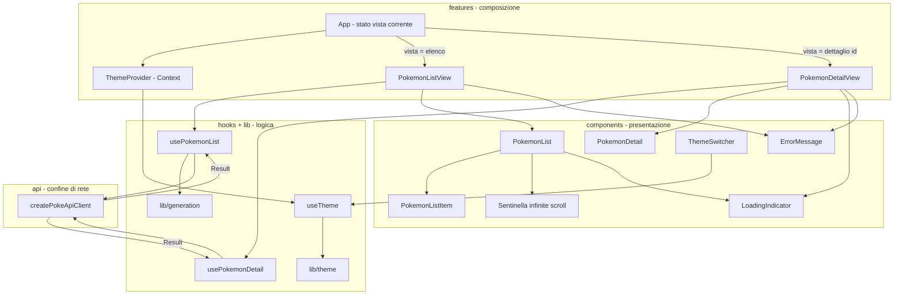

# Design Document: pokedex-themed-views

## Overview

Questa feature aggiunge all'Applicazione due viste (Vista_Elenco e Vista_Dettaglio) e un
sistema di temi commutabili al volo (Tema_Rosso e Tema_Diamante), costruiti sopra il
`Client_PokeAPI` già esistente (`createPokeApiClient`). La portata dei dati è limitata alla
Prima_Generazione: esattamente i 151 Pokémon di Kanto con identificatore 1..151.

L'obiettivo di design è mantenere puliti i confini architetturali già stabiliti:

- **Solo `src/api/`** conosce la forma grezza (snake_case) delle PokéAPI. Il resto
  dell'app lavora con i tipi di dominio di `src/types/pokemon.ts`.
- **La logica** (infinite scroll, filtro Prima_Generazione, estrazione id dall'URL,
  gestione temi) vive in `src/lib/` e `src/hooks/`, testabile in modo deterministico con
  `fetch` mockato.
- **I componenti** in `src/components/` restano "stupidi" (presentazione): ricevono dati e
  callback via props e non contengono logica di fetch né di stato applicativo.

Il Requirement 8 (Sprite_Pokemon) richiede di estendere il livello `api/` e il tipo di
dominio `Pokemon` con un campo `spriteUrl: string | null`, sempre in TDD, mantenendo il
confine: `raw.ts` guadagna il campo `sprites`, `parse.ts` lo verifica difensivamente e
`mappers.ts` (`mapPokemon`) lo traduce in `spriteUrl`.

### Decisioni di design in sintesi

| Decisione | Scelta | Motivazione |
| --- | --- | --- |
| Navigazione Elenco ↔ Dettaglio | State-based (un `useState` con vista corrente in `App`) | Semplicità per il workshop; nessuna dipendenza aggiuntiva; l'app ha due sole viste. Vedi [Architettura](#navigazione-tra-le-viste). |
| Infinite scroll | `IntersectionObserver` su una sentinella in coda alla lista | API browser standard, nessuna dipendenza; la logica di "quando caricare" resta nell'hook, la sentinella nel componente. |
| Filtro Prima_Generazione | Funzione pura in `lib/` che ricava l'id dall'URL del `ResourceReference` e scarta id fuori 1..151 | Logica pura, facilmente testabile con property-based testing. |
| Sistema di temi | React Context + hook `useTheme`; CSS custom properties applicate via `data-theme` sull'elemento radice | Commutazione al volo senza reload; un solo punto applica il tema a entrambe le viste. |
| Persistenza tema | `localStorage` dietro un'astrazione iniettabile | Deterministico e mockabile nei test (Requirement 9.5). |
| Libreria PBT | `fast-check` (già in `devDependencies`) | Coerente con lo stack; property test a ≥100 iterazioni. |
| Test dei componenti | React Testing Library (`@testing-library/react` + `@testing-library/user-event`, da aggiungere) | Convenzione dello steering `tech`. |

## Architecture

### Livelli

L'applicazione mantiene una separazione stretta a livelli. Il flusso dei dati è
unidirezionale: dal `Client_PokeAPI` (rete) verso il dominio, poi agli hook (stato e
logica), infine ai componenti (presentazione).

```
src/
├── api/            # confine di rete: SOLO qui si conosce la forma PokéAPI
│   ├── pokeApiClient.ts   (esistente)
│   ├── raw.ts, parse.ts, mappers.ts   (estesi per lo sprite - Req 8)
│   └── ...
├── types/
│   └── pokemon.ts  # Pokemon esteso con spriteUrl (Req 8.1)
├── lib/            # logica pura, senza React
│   ├── generation.ts   # estrazione id da URL + filtro Prima_Generazione
│   └── theme.ts        # definizione temi, parsing/validazione tema persistito
├── hooks/          # logica con stato React
│   ├── usePokemonList.ts     # infinite scroll + filtro (Req 1, 2, 9.3)
│   ├── usePokemonDetail.ts   # fetch dettaglio (Req 3, 4)
│   └── useTheme.ts           # accesso al Gestore_Temi (Req 5, 9.4)
├── features/       # composizione: collega hook e componenti
│   ├── ThemeProvider.tsx     # Context del Gestore_Temi
│   ├── PokemonListView.tsx   # Vista_Elenco (usa usePokemonList + PokemonList)
│   └── PokemonDetailView.tsx # Vista_Dettaglio (usa usePokemonDetail + PokemonDetail)
└── components/     # presentazione "stupida"
    ├── PokemonList.tsx, PokemonListItem.tsx
    ├── PokemonDetail.tsx
    ├── ThemeSwitcher.tsx
    ├── LoadingIndicator.tsx
    └── ErrorMessage.tsx
```

### Diagramma dei componenti e del flusso dati



### Navigazione tra le viste

La navigazione è **state-based**, non basata su URL/router. `App` mantiene uno stato
discriminato che rappresenta la vista corrente:

```typescript
type Route =
  | { readonly view: 'list' }
  | { readonly view: 'detail'; readonly id: number };
```

- Alla selezione di un elemento della lista (Req 1.6), `App` passa a `{ view: 'detail', id }`.
- Al comando di ritorno dal dettaglio (Req 3.7), `App` torna a `{ view: 'list' }`.

Motivazione: l'app ha due sole viste e nessun requisito di deep-linking, refresh su URL o
navigazione browser. Introdurre `react-router` aggiungerebbe una dipendenza e complessità di
routing non necessarie per il workshop; lo stato locale è più semplice da mostrare dal vivo e
mantiene il numero di concetti basso. Il `ThemeProvider` avvolge entrambe le viste, così il
cambio di tema si applica sia alla Vista_Elenco sia alla Vista_Dettaglio (Req 5.5).

## Components and Interfaces

### Livello `lib/` (logica pura)

`src/lib/generation.ts` — estrazione dell'id numerico dal `ResourceReference` e filtro alla
Prima_Generazione. Nessuna dipendenza da React o dalla rete.

```typescript
import type { ResourceReference } from '../types/pokemon';

/** Limiti inclusivi della Prima_Generazione (Kanto). */
export const FIRST_GEN_MIN_ID = 1;
export const FIRST_GEN_MAX_ID = 151;

/**
 * Estrae l'id numerico dall'URL di un ResourceReference PokéAPI
 * (es. ".../pokemon/25/" -> 25). Restituisce null se l'URL non contiene
 * un id numerico riconoscibile.
 */
export function extractIdFromUrl(url: string): number | null;

/** Vero se l'id appartiene alla Prima_Generazione (1..151 inclusi). */
export function isFirstGeneration(id: number): boolean;

/** Voce di elenco già arricchita con l'id numerico ricavato dall'URL. */
export interface PokemonListEntry {
  readonly id: number;
  readonly name: string;
  readonly url: string;
}

/**
 * Filtra i ResourceReference tenendo solo quelli della Prima_Generazione,
 * arricchendoli con l'id numerico. Scarta i riferimenti senza id valido o
 * fuori 1..151. Preserva l'ordine d'ingresso.
 */
export function toFirstGenEntries(
  references: readonly ResourceReference[],
): readonly PokemonListEntry[];
```

`src/lib/theme.ts` — definizione dei temi e validazione del tema persistito. Pura.

```typescript
export type ThemeName = 'rosso' | 'diamante';

/** Nome del tema predefinito (Req 5.2, 5.7). */
export const DEFAULT_THEME: ThemeName = 'rosso';

/**
 * Normalizza un valore persistito sconosciuto in un ThemeName valido.
 * Restituisce DEFAULT_THEME se il valore non corrisponde ad alcun tema (Req 5.7).
 */
export function normalizeThemeName(persisted: unknown): ThemeName;
```

### Livello `hooks/` (logica con stato)

`src/hooks/usePokemonList.ts` — infinite scroll + filtro Prima_Generazione (Req 1, 2, 9.3).

```typescript
import type { PokeApiClient } from '../api/pokeApiClient';
import type { PokeApiError } from '../api/errors';
import type { PokemonListEntry } from '../lib/generation';

export interface UsePokemonListResult {
  /** Voci già caricate, filtrate alla Prima_Generazione, in ordine di id crescente. */
  readonly entries: readonly PokemonListEntry[];
  /** True mentre il PRIMO blocco carica e nessuna voce è ancora mostrata (Req 2.1). */
  readonly isInitialLoading: boolean;
  /** True mentre un blocco successivo carica (Req 2.2). */
  readonly isLoadingMore: boolean;
  /** Errore dell'ultimo blocco fallito, altrimenti null (Req 2.3). */
  readonly error: PokeApiError | null;
  /** True quando sono stati coperti tutti i 151 e non si richiede altro (Req 1.5). */
  readonly isComplete: boolean;
  /** True quando il primo blocco è ok ma non produce voci di Prima_Generazione (Req 2.6). */
  readonly isEmpty: boolean;
  /** Chiede il blocco successivo; invocato dalla sentinella (Req 1.4). */
  readonly loadMore: () => void;
  /** Ritenta l'ultimo blocco fallito (Req 2.4, 2.5). */
  readonly retry: () => void;
}

/**
 * Gestisce il caricamento incrementale dell'elenco. Usa il client per `list`
 * con limit=20 e offset crescente di 20, filtra alla Prima_Generazione tramite
 * lib/generation e si ferma una volta coperto l'id 151 (Req 1.5).
 */
export function usePokemonList(client: PokeApiClient): UsePokemonListResult;
```

`src/hooks/usePokemonDetail.ts` — fetch del dettaglio (Req 3, 4).

```typescript
import type { PokeApiClient } from '../api/pokeApiClient';
import type { PokeApiError } from '../api/errors';
import type { Pokemon } from '../types/pokemon';

export interface UsePokemonDetailResult {
  readonly pokemon: Pokemon | null;
  readonly isLoading: boolean; // Req 4.1, 4.2
  readonly error: PokeApiError | null; // Req 4.3, 4.4
  /** True quando l'errore è di categoria "risorsa non trovata" (Req 4.3). */
  readonly isNotFound: boolean;
  readonly retry: () => void; // Req 4.5
}

/** Richiede il Pokémon con `get(id)` e ne espone stato/errore (Req 3.1, 4.x). */
export function usePokemonDetail(
  client: PokeApiClient,
  id: number,
): UsePokemonDetailResult;
```

`src/hooks/useTheme.ts` — accesso al Gestore_Temi via Context (Req 5, 9.4).

```typescript
import type { ThemeName } from '../lib/theme';

export interface UseThemeResult {
  readonly theme: ThemeName;
  readonly setTheme: (name: ThemeName) => void; // Req 5.4, 5.6
}

/** Legge/aggiorna il tema attivo dal ThemeContext. */
export function useTheme(): UseThemeResult;
```

### Livello `features/` (composizione)

`src/features/ThemeProvider.tsx` — Context del Gestore_Temi. Applica il tema all'elemento
radice via attributo `data-theme` e persiste la scelta.

```typescript
import type { ReactNode } from 'react';

/** Astrazione di storage iniettabile per rendere i test deterministici (Req 9.5). */
export interface ThemeStorage {
  read(): string | null;
  write(value: string): void;
}

export interface ThemeProviderProps {
  readonly children: ReactNode;
  /** Default: adapter su window.localStorage. Iniettabile nei test. */
  readonly storage?: ThemeStorage;
}

/**
 * Fornisce il ThemeContext: legge il tema persistito (o DEFAULT_THEME),
 * lo applica come data-theme sull'elemento radice e lo ripersiste ad ogni
 * cambio (Req 5.2, 5.5, 5.6, 5.7).
 */
export function ThemeProvider(props: ThemeProviderProps): JSX.Element;
```

`src/features/PokemonListView.tsx` e `src/features/PokemonDetailView.tsx` collegano
rispettivamente `usePokemonList`/`usePokemonDetail` ai componenti di presentazione e
scelgono cosa mostrare tra LoadingIndicator, ErrorMessage, Stato_Vuoto e i dati.

```typescript
export interface PokemonListViewProps {
  readonly client: PokeApiClient;
  readonly onSelect: (id: number) => void; // Req 1.6
}

export interface PokemonDetailViewProps {
  readonly client: PokeApiClient;
  readonly id: number;
  readonly onBack: () => void; // Req 3.7
}
```

### Livello `components/` (presentazione)

Componenti senza logica di fetch né di stato applicativo: ricevono dati e callback via props.

```typescript
// PokemonList: elenco continuo con sentinella per l'infinite scroll.
export interface PokemonListProps {
  readonly entries: readonly PokemonListEntry[];
  readonly isLoadingMore: boolean; // mostra LoadingIndicator in coda (Req 2.2)
  readonly onSelect: (id: number) => void; // Req 1.6
  readonly onReachEnd: () => void; // invocato dalla sentinella (Req 1.4)
}

// PokemonListItem: una riga. In Tema_Rosso "numero nome" con cursore freccia
// sull'elemento selezionato (Req 6.6, 6.7); in Tema_Diamante "numero nome tipi" (Req 7.4).
export interface PokemonListItemProps {
  readonly entry: PokemonListEntry;
  readonly isSelected: boolean; // cursore freccia in Tema_Rosso (Req 6.6)
  readonly onSelect: (id: number) => void;
}

// PokemonDetail: numero, nome, altezza, peso, base exp, tipi (ordinati per slot),
// abilità e sprite (Req 3.2-3.6, 8.2-8.6).
export interface PokemonDetailProps {
  readonly pokemon: Pokemon;
  readonly onBack: () => void; // Req 3.7
}

// ThemeSwitcher: Selettore_Tema (Req 5.3).
export interface ThemeSwitcherProps {
  readonly theme: ThemeName;
  readonly onChange: (name: ThemeName) => void;
}

// LoadingIndicator e ErrorMessage: presentazione degli stati.
export interface LoadingIndicatorProps {
  readonly label?: string;
}

export interface ErrorMessageProps {
  readonly category: PokeApiError['category']; // Req 2.3, 4.4
  readonly message: string;
  readonly onRetry?: () => void; // Req 2.4, 4.5
}
```

### Sprite nel dettaglio (Req 8)

`PokemonDetail` mostra lo sprite gestendo tre casi con un unico segnaposto che occupa lo
stesso spazio di layout:

- `spriteUrl` valorizzato → `` (Req 8.2).
- `spriteUrl === null` → segnaposto delle stesse dimensioni (Req 8.3).
- `onError` dell'immagine → stato locale che sostituisce l'immagine col segnaposto,
  evitando l'immagine interrotta (Req 8.4).

La resa cromatica dello sprite è responsabilità del tema (CSS): in Tema_Rosso si applica un
filtro/duotone alla palette a quattro tonalità (Req 8.5); in Tema_Diamante lo sprite resta a
colori pieni (Req 8.6). Il componente espone una classe/hook CSS stabile
(`.pokedex-sprite`) su cui i due temi agiscono.

## Data Models

### Estensione del dominio: `Pokemon.spriteUrl` (Req 8.1)

`src/types/pokemon.ts` — si aggiunge il campo `spriteUrl`:

```typescript
export interface Pokemon {
  readonly id: number;
  readonly name: string;
  readonly height: number;
  readonly weight: number;
  readonly baseExperience: number;
  readonly abilities: readonly PokemonAbility[];
  readonly types: readonly PokemonType[];
  readonly spriteUrl: string | null; // <- NUOVO (Req 8.1): da sprites.front_default
}
```

### Estensione dei tipi Raw (solo dentro `api/`)

`src/api/raw.ts` — si aggiunge il campo `sprites`. Le PokéAPI espongono
`sprites.front_default` come `string | null`; tipizziamo solo ciò che consumiamo.

```typescript
export interface PokemonSpritesRaw {
  readonly front_default: string | null;
}

export interface PokemonRaw {
  // ... campi esistenti ...
  readonly sprites: PokemonSpritesRaw; // <- NUOVO (Req 8)
}
```

`src/api/parse.ts` — narrowing difensivo del campo `sprites`. Il confine non si fida della
forma: se `sprites` manca o `front_default` non è né stringa né `null`, `spriteUrl` diventa
`null` (nessun dominio parziale, coerente con la filosofia di `parse.ts`). In pratica:

```typescript
// dentro parsePokemonRaw, dopo aver validato gli altri campi:
// sprites è un record e sprites.front_default è string oppure null;
// altrimenti si normalizza front_default a null.
```

`src/api/mappers.ts` — `mapPokemon` traduce `raw.sprites.front_default` in `spriteUrl`:

```typescript
export function mapPokemon(raw: PokemonRaw): Pokemon {
  return {
    // ... campi esistenti ...
    spriteUrl: raw.sprites.front_default,
  };
}
```

Tutte queste estensioni si sviluppano in TDD: prima un test rosso sul mapper/parse per lo
sprite (incluso il caso `null` e il caso campo mancante), poi l'implementazione verde.

### Modello dei temi

`src/lib/theme.ts` definisce i nomi dei temi. La rappresentazione visiva vive in CSS come
custom properties selezionate da `data-theme`. Non serve un oggetto JS con i valori di
colore: i temi sono descritti in CSS, la logica JS conosce solo il `ThemeName`.

```typescript
export type ThemeName = 'rosso' | 'diamante';

export interface ThemeContextValue {
  readonly theme: ThemeName;
  readonly setTheme: (name: ThemeName) => void;
}
```

### Il sistema di temi in CSS

Ogni tema definisce un insieme coerente di CSS custom properties, selezionate dall'attributo
`data-theme` sull'elemento radice. Le viste consumano **solo** le variabili, mai i valori
diretti, così lo stesso markup rende in entrambi i temi (Req 5.5).

```css
/* Tema_Rosso: palette Game Boy a 4 tonalità (Req 6.1, 6.2, 6.3, 6.5) */
[data-theme='rosso'] {
  --bg: #9bbc0f;          /* sfondo predefinito (Req 6.2) */
  --bg-alt: #8bac0f;
  --accent: #306230;
  --text: #0f380f;        /* testo, contrasto >= 4.5:1 su --bg (Req 6.2) */
  --border-color: #0f380f;
  --border-width: 3px;    /* 2..4 px (Req 6.5) */
  --radius: 0px;          /* angoli squadrati (Req 6.5) */
  --font: 'PixelFont', ui-monospace, monospace; /* pixel + fallback (Req 6.3, 6.4) */
  --sprite-filter: /* duotone verso la palette a 4 tonalità (Req 8.5) */;
}

/* Tema_Diamante: colori pieni, dominante blu (Req 7.1, 7.2, 7.3) */
[data-theme='diamante'] {
  --bg: #2a4b8d;          /* blu dominante (Req 7.1) */
  --bg-alt: #e9eef7;
  --accent: #3d6bd6;
  --text: #10233f;
  --border-color: #2a4b8d;
  --border-width: 1px;
  --radius: 12px;         /* 8..16 px (Req 7.2) */
  --font: system-ui, -apple-system, 'Segoe UI', sans-serif; /* antialiasato >=14px (Req 7.3) */
  --sprite-filter: none;  /* colori pieni (Req 8.6) */
}
```

Il cursore a freccia del Tema_Rosso (Req 6.6) si realizza con uno pseudo-elemento
sull'elemento selezionato, visibile solo sotto `[data-theme='rosso']`. In Tema_Diamante la
riga mostra anche i tipi (Req 7.4): `PokemonListItem` rende sempre i tipi nel markup e il CSS
del Tema_Rosso li nasconde (mantenendo "numero nome" — Req 6.7), mentre il Tema_Diamante li
mostra.

## Correctness Properties

*Una proprietà è una caratteristica o un comportamento che deve valere per tutte le
esecuzioni valide del sistema: in sostanza un'affermazione formale su cosa il sistema debba
fare. Le proprietà fanno da ponte tra le specifiche leggibili dall'uomo e le garanzie di
correttezza verificabili dalla macchina.*

Le proprietà seguenti derivano dall'analisi di prework degli acceptance criteria, dopo la
riflessione per eliminare le ridondanze. I criteri puramente estetici/strutturali (temi in
CSS, confini architetturali) sono verificati con test di esempio/snapshot o revisione, non
con property-based testing (vedi [Testing Strategy](#testing-strategy)).

### Property 1: Il filtro Prima_Generazione non produce mai id fuori 1..151

*Per ogni* insieme di `ResourceReference` (con URL contenenti id qualsiasi, anche `< 1`,
`> 151`, o non numerici), `toFirstGenEntries` restituisce solo voci con `id` compreso tra 1
e 151 inclusi, preservando l'ordine d'ingresso dei riferimenti ammessi.

**Validates: Requirements 1.2, 1.3**

### Property 2: L'estrazione dell'id dall'URL è coerente con la ricostruzione dell'URL

*Per ogni* id intero valido, costruendo un URL PokéAPI della forma `.../pokemon/{id}/` ed
estraendone l'id con `extractIdFromUrl`, si riottiene lo stesso id (round trip su
id → url → id).

**Validates: Requirements 1.2, 1.3**

### Property 3: La progressione degli offset copre il 151 senza salti né ripetizioni

*Per ogni* esecuzione dell'infinite scroll su un backing deterministico che contiene la
Prima_Generazione, gli `offset` richiesti al client formano la sequenza `0, 20, 40, ...`
(passo 20, senza salti né duplicati) e le richieste cessano non appena l'elenco copre l'id
151 (`isComplete` diventa vero e ulteriori `loadMore` non generano nuove chiamate).

**Validates: Requirements 1.4, 1.5**

### Property 4: L'elenco cresce per concatenazione filtrata senza rimuovere le voci precedenti

*Per ogni* sequenza di Blocco_Elenco caricati in ordine, l'elenco delle `entries` dopo il
caricamento di un nuovo blocco ha come prefisso l'elenco precedente (nessuna voce già
mostrata viene rimossa o riordinata), e le nuove voci sono esattamente quelle del blocco
filtrate alla Prima_Generazione.

**Validates: Requirements 1.3, 2.2**

### Property 5: La categoria dell'errore è propagata fedelmente e nessuna eccezione sfugge

*Per ogni* `PokeApiError` restituito dal client (qualunque delle quattro categorie) o
fallimento di rete simulato, sia `usePokemonList` sia `usePokemonDetail` espongono uno stato
di errore osservabile con la stessa `category` restituita dal client, senza sollevare
eccezioni non gestite.

**Validates: Requirements 2.3, 4.4, 9.6**

### Property 6: Il dettaglio mostra tutti i campi scalari del Pokémon

*Per ogni* `Pokemon` valido, il markup della Vista_Dettaglio contiene il numero
identificativo, il nome, l'altezza, il peso e l'esperienza base.

**Validates: Requirements 3.2, 3.3**

### Property 7: I tipi sono resi in ordine di slot crescente

*Per ogni* `Pokemon` i cui tipi sono forniti in ordine arbitrario, la Vista_Dettaglio rende
i tipi ordinati per `slot` crescente.

**Validates: Requirements 3.4**

### Property 8: Tutte le abilità del Pokémon compaiono nel dettaglio

*Per ogni* `Pokemon` valido, per ogni abilità nella sua collezione il nome dell'abilità
compare nel markup della Vista_Dettaglio.

**Validates: Requirements 3.5**

### Property 9: Ogni riga dell'elenco contiene numero, nome e tipi

*Per ogni* voce dell'elenco, la riga renderizzata contiene il numero identificativo, il nome
e i tipi del Pokémon (la visibilità dei tipi è poi regolata dal tema: nascosti in Tema_Rosso,
mostrati in Tema_Diamante, ma sempre presenti nel markup dei dati).

**Validates: Requirements 6.7, 7.4**

### Property 10: `spriteUrl` riflette fedelmente `sprites.front_default`

*Per ogni* `PokemonRaw` generato (con `sprites.front_default` stringa oppure `null`),
`mapPokemon(raw).spriteUrl` è uguale a `raw.sprites.front_default`. Quando `sprites` è
assente o malformato, `spriteUrl` è `null` (nessun dominio parziale).

**Validates: Requirements 8.1**

### Property 11: Con sprite valorizzato il dettaglio rende un'immagine con alt uguale al nome

*Per ogni* `Pokemon` con `spriteUrl` non nullo, la Vista_Dettaglio rende un'immagine con
`src` pari a `spriteUrl` e testo alternativo pari al nome del Pokémon.

**Validates: Requirements 8.2**

### Property 12: La normalizzazione del tema persistito è totale e stabile sui temi validi

*Per ogni* valore persistito arbitrario, `normalizeThemeName` restituisce sempre un
`ThemeName` valido; per i valori `'rosso'` e `'diamante'` li restituisce invariati, per
qualsiasi altro valore restituisce `'rosso'` (default).

**Validates: Requirements 5.7**

### Property 13: La persistenza del tema è un round trip

*Per ogni* `ThemeName` scelto e persistito tramite il `ThemeStorage`, reinizializzando il
Gestore_Temi dallo stesso storage il tema attivo ripristinato è esattamente quello scelto.

**Validates: Requirements 5.6**

## Error Handling

Il livello `api/` già incapsula gli errori in `Result<T>` con `PokeApiError.category` in
{"risorsa non trovata", "risposta HTTP non valida", "parametri non validi", "errore di
rete"}. Gli hook non lanciano eccezioni: convertono il ramo `ok: false` in stato osservabile.

### Elenco (`usePokemonList` / PokemonListView)

- **Primo blocco in errore**: `error` valorizzato, `isInitialLoading` false. La vista mostra
  `ErrorMessage` con la categoria (Req 2.3) e un comando di retry (Req 2.4).
- **Blocco successivo in errore**: le voci già caricate restano invariate (Property 4); in
  coda si mostra `ErrorMessage` con retry sullo stesso `offset` (Req 2.4, 2.5).
- **Retry**: azzera `error`, riporta a caricamento il blocco fallito e richiede lo stesso
  `offset` (Req 2.5).
- **Stato_Vuoto**: primo blocco `ok` ma nessuna voce di Prima_Generazione → `isEmpty` true,
  messaggio dedicato (Req 2.6).

### Dettaglio (`usePokemonDetail` / PokemonDetailView)

- **"risorsa non trovata"**: `isNotFound` true, `pokemon` null, messaggio "il Pokémon non
  esiste", nessun dato parziale (Req 4.3).
- **Altre categorie**: `ErrorMessage` con la categoria (Req 4.4).
- **Retry**: nuova `get` sullo stesso id, ripristino di `isLoading` e azzeramento di `error`
  (Req 4.5).

### Robustezza (Req 9.6)

Ogni fallimento del `fetch` mockato è già tradotto dal client in `PokeApiError` di categoria
"errore di rete"; gli hook lo espongono come stato di errore senza `throw` (Property 5). Le
richieste in volo vengono ignorate se il componente è smontato o se l'id/offset cambia
(guardia sui risultati obsoleti) per evitare aggiornamenti su stato non più valido.

### Sprite (Req 8.3, 8.4)

`PokemonDetail` gestisce sia `spriteUrl === null` sia l'evento `onError` dell'immagine con lo
**stesso** segnaposto, che occupa lo spazio di layout previsto per l'immagine, evitando di
mostrare un'immagine interrotta.

## Testing Strategy

Sviluppo in **TDD** (Red → Green → Refactor): per ogni pezzo di logica si scrive prima il
test che fallisce, poi l'implementazione minima. I test vivono in cartelle `__tests__/`
accanto al modulo, con suffisso `.test.ts(x)`. Tutti i test sono deterministici: nessuna rete
reale, `fetch`/client mockati (Req 9.5). L'esecuzione è single-run (`vitest run`), mai watch.

### Approccio duale

- **Property-based test** (`fast-check`, già in `devDependencies`): coprono le proprietà
  universali della sezione Correctness Properties. Ogni property test:
  - esegue **almeno 100 iterazioni** (`fc.assert(fc.property(...), { numRuns: 100 })`);
  - riferisce la proprietà del design con un commento tag nel formato
    **Feature: pokedex-themed-views, Property {number}: {property_text}**;
  - implementa **una singola** property per test.
- **Unit test di esempio**: coprono comportamenti specifici, transizioni di stato ed edge
  case (chiamate al client con parametri fissi, Stato_Vuoto, not found, retry, sprite null).
- **Test dei componenti** con React Testing Library (`@testing-library/react` +
  `@testing-library/user-event`, da aggiungere alle `devDependencies` insieme a `jsdom` come
  ambiente Vitest): interazioni (selezione riga, ritorno, cambio tema) e rendering.

### Cosa NON si copre con PBT

I criteri estetici dei temi (Req 6.1–6.5, 7.1–7.3, 8.5, 8.6) e i confini architetturali (Req
9.1–9.4) non sono funzioni con proprietà universali: si verificano con test di esempio sulle
CSS custom properties / snapshot dei componenti nei due temi, con un test mirato sul contrasto
WCAG della coppia testo/sfondo del Tema_Rosso (Req 6.2), e con la revisione degli import
(nessun tipo Raw fuori da `api/`). Questa è la scelta corretta perché tali criteri riguardano
resa visiva e struttura, non trasformazioni di dati.

### Mappatura proprietà → test

| Proprietà | Modulo sotto test | Tipo |
| --- | --- | --- |
| 1, 2 | `lib/generation` | property |
| 3, 4, 5 | `hooks/usePokemonList` (client mockato) | property |
| 5 | `hooks/usePokemonDetail` (client mockato) | property |
| 6, 7, 8, 11 | `components/PokemonDetail` (RTL) | property |
| 9 | `components/PokemonListItem` / `PokemonList` (RTL) | property |
| 10 | `api/mappers` (`mapPokemon`) + `api/parse` | property |
| 12 | `lib/theme` (`normalizeThemeName`) | property |
| 13 | `features/ThemeProvider` (storage mockato) | property |

### Esempi e edge case principali (unit)

- `usePokemonList`: prima chiamata `{limit:20, offset:0}` (Req 1.1); Stato_Vuoto (Req 2.6);
  retry sullo stesso offset (Req 2.4, 2.5); `isInitialLoading` vs `isLoadingMore` (Req 2.1,
  2.2).
- `usePokemonDetail`: `get(id)` chiamato (Req 3.1); not found (Req 4.3); retry (Req 4.5);
  transizioni di `isLoading` (Req 4.1, 4.2).
- `PokemonDetail`: collezioni vuote senza crash (Req 3.6); sprite null → segnaposto (Req 8.3);
  `onError` → segnaposto (Req 8.4); cursore selezione (Req 6.6).
- `ThemeProvider`/`useTheme`: default rosso a storage vuoto (Req 5.2); cambio tema senza
  reload applicato alla radice (Req 5.4, 5.5); Selettore_Tema presente con due opzioni (Req
  5.1, 5.3).
- `api/parse` + `api/mappers`: sprite mancante/malformato → `spriteUrl` null (Req 8.1).

## Mappatura Design → Requisiti

| Requirement | Componente / decisione di design |
| --- | --- |
| 1.1 | `usePokemonList` (prima `list` con limit=20, offset=0) |
| 1.2 | `lib/generation` (`extractIdFromUrl`, `isFirstGeneration`, `toFirstGenEntries`) |
| 1.3 | `usePokemonList` + `lib/generation` (append filtrato in coda) |
| 1.4 | `usePokemonList.loadMore` + sentinella `IntersectionObserver` in `PokemonList` |
| 1.5 | `usePokemonList` (`isComplete` a copertura del 151) |
| 1.6 | `App` (Route state) + `PokemonList/PokemonListItem` `onSelect` |
| 2.1, 2.2 | `usePokemonList` (`isInitialLoading`/`isLoadingMore`) + `LoadingIndicator` |
| 2.3, 2.4, 2.5 | `usePokemonList` (`error`, `retry`) + `ErrorMessage` |
| 2.6 | `usePokemonList` (`isEmpty`) + Stato_Vuoto in `PokemonListView` |
| 3.1 | `usePokemonDetail` (`get(id)`) |
| 3.2–3.6 | `PokemonDetail` (campi scalari, tipi ordinati per slot, abilità, collezioni vuote) |
| 3.7 | `App` + `PokemonDetail` `onBack` |
| 4.1–4.5 | `usePokemonDetail` (`isLoading`, `isNotFound`, `error`, `retry`) + `ErrorMessage` |
| 5.1–5.7 | `features/ThemeProvider`, `hooks/useTheme`, `lib/theme`, `components/ThemeSwitcher` |
| 6.1–6.7 | CSS `[data-theme='rosso']` + `PokemonListItem` (cursore freccia, "numero nome") |
| 7.1–7.4 | CSS `[data-theme='diamante']` + `PokemonListItem` (riga "numero nome tipi") |
| 8.1 | `types/pokemon` (`spriteUrl`), `api/raw` (`sprites`), `api/parse`, `api/mappers` |
| 8.2–8.4 | `PokemonDetail` (immagine/segnaposto, `onError`) |
| 8.5, 8.6 | CSS dei temi (`--sprite-filter`) applicato a `.pokedex-sprite` |
| 9.1, 9.2 | Confine `api/`: hook/viste ricevono solo tipi di dominio |
| 9.3 | `lib/generation` + `hooks/usePokemonList` |
| 9.4 | `features/ThemeProvider` + `hooks/useTheme` |
| 9.5, 9.6 | `fetch`/client mockati nei test; hook che non lanciano eccezioni |
