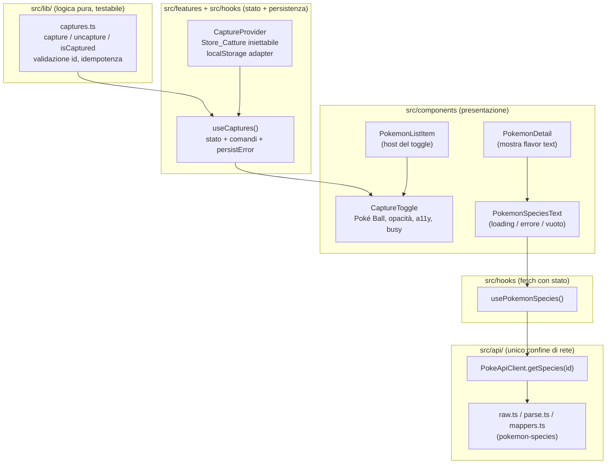
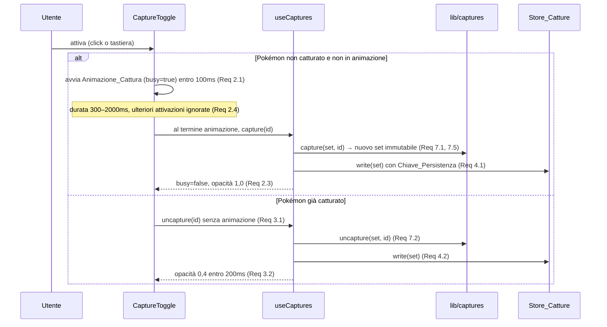
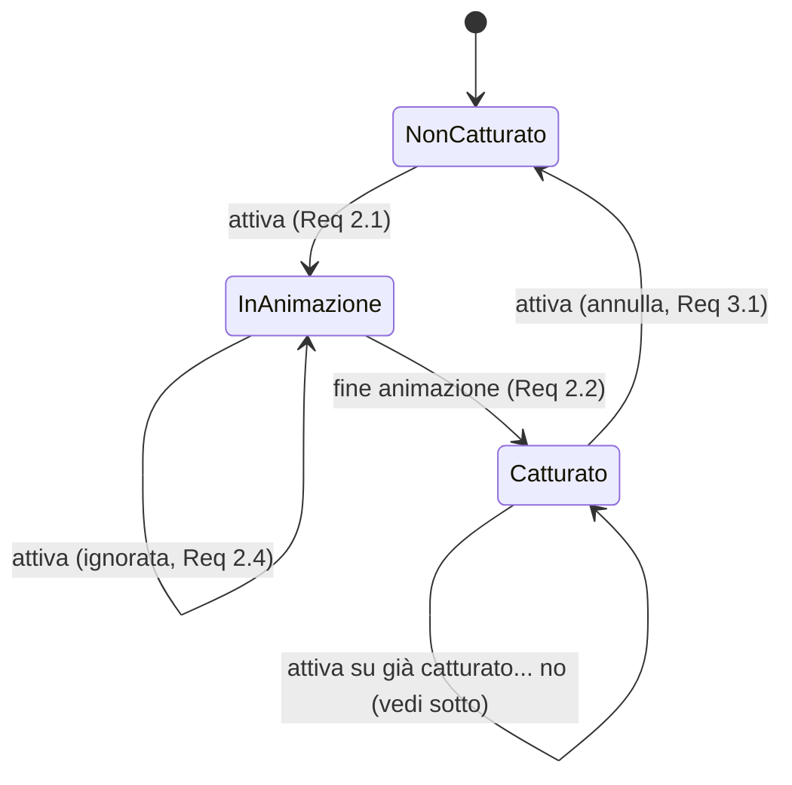

# Design Document

## Overview

Questa funzionalità introduce la **cattura dei Pokémon** direttamente
dall'Elenco tramite un pulsante Poké Ball (Toggle_Cattura) alla destra di ogni
voce, un'Animazione_Cattura in stile giochi Pokémon, la persistenza locale delle
catture e, nella Vista_Dettaglio, la Descrizione_Pokedex (flavor text) per i
Pokémon catturati. L'aspetto di Poké Ball e animazioni segue il Tema_Attivo.

Il design segue le convenzioni del progetto già consolidate:

- **Logica pura in `lib/`**: il core del Gestore_Catture (operazioni su un
  insieme di id catturati) vive in `src/lib/captures.ts` come funzioni pure e
  immutabili, sviluppabili in TDD senza DOM né rete (_Requirements 7.x_).
- **Persistenza iniettabile**: lo Store_Catture ricalca il pattern di
  `ThemeProvider` (adapter su `window.localStorage`, chiave dedicata, adapter
  iniettabile per i test), esposto tramite un Context + hook `useCaptures`
  (_Requirements 4.x_).
- **Confine di rete solo in `api/`**: il flavor text arriva dall'endpoint
  PokéAPI `pokemon-species/{id}`; il `Client_PokeAPI` acquisisce un nuovo metodo
  `getSpecies` che restituisce un **tipo di dominio** (`PokemonSpecies`),
  tenendo la forma grezza (snake_case) dentro `api/` (_Requirements 5.1, 5.7_).
- **Componenti "stupidi"**: il Toggle_Cattura è di presentazione; stato e
  transizioni stanno nell'hook `useCaptures` e nella logica pura.
- **Temi via CSS**: come per il tema, la logica JS conosce solo il `ThemeName`;
  l'aspetto di Poké Ball e animazioni è selezionato da `data-theme`
  (_Requirements 6.x_).

### Requisiti chiave affrontati

- Toggle_Cattura con opacità 0,4 / 1,0, nome accessibile, parità tastiera/mouse,
  stato "busy" durante l'animazione (_Req 1.x, 2.x, 3.x_).
- Idempotenza della cattura e validazione di id interi positivi (_Req 7.5, 7.7_).
- Persistenza robusta con inizializzazione difensiva e gestione degli errori di
  lettura/scrittura (_Req 4.x_).
- Descrizione_Pokedex: fetch singolo, caricamento, categoria d'errore, testo
  vuoto, dettagli residui sempre visibili (_Req 5.x_).
- Adattamento al tema con fallback a `rosso` (_Req 6.x_).

## Architecture

L'architettura separa nettamente **logica pura**, **stato/persistenza**,
**presentazione** e **rete**, come nel resto dell'app.



### Flusso di cattura (animazione → stato → persistenza)



### Decisioni di design e razionale

- **Il core della cattura è puro (`lib/captures.ts`)**. Le operazioni prendono
  un insieme immutabile di id e ne restituiscono uno nuovo: idempotenza,
  validazione e "insieme vuoto iniziale" diventano proprietà testabili senza
  React (_Req 7.x_). Questo abilita anche il property-based test sull'idempotenza.
- **L'animazione vive nel Toggle_Cattura, non nella logica pura**. La logica
  pura non conosce il tempo; la transizione temporizzata (300–2000ms) e lo stato
  "busy" sono responsabilità del componente, che chiama `capture(id)` solo al
  termine (_Req 2.1, 2.2, 2.4_). Così il core resta deterministico e testabile.
- **`useCaptures` come Gestore_Catture applicativo**. L'hook detiene lo stato
  reattivo (`Set<number>` esposto come query), applica le funzioni pure e
  gestisce la persistenza e il suo fallimento (_Req 4.6_), replicando il pattern
  Context+hook di `useTheme`.
- **Species come nuovo confine di rete in `api/`**. Il flavor text è un'altra
  risorsa PokéAPI; per rispettare i confini, aggiungiamo tipi Raw, parsing
  difensivo, mapper e un metodo client dedicato che restituisce dominio
  (_Req 5.7_). Il resto dell'app non vede mai la forma grezza.
- **Selezione del flavor text**: `pokemon-species` restituisce molte voci
  `flavor_text_entries` (per lingua/versione). Selezioniamo in modo
  deterministico la prima voce in lingua inglese (`language.name === 'en'`) e ne
  normalizziamo gli spazi/gli a-capo; se assente, ricadiamo sulla prima voce
  disponibile; se nessuna, il testo di dominio è stringa vuota (gestito come
  "descrizione non disponibile", _Req 5.6_).
- **Temi via CSS**: come per il tema esistente, JS applica classi/attributi
  stabili e il CSS (selezionato da `data-theme`) definisce l'aspetto di Poké Ball
  e animazione, con `rosso` come default anche per valori sconosciuti
  (_Req 6.4_). Poiché `normalizeThemeName` già ripiega su `rosso`, un tema
  sconosciuto non arriva mai come `data-theme` non valido.

## Components and Interfaces

### 1. `src/lib/captures.ts` (logica pura — Gestore_Catture core)

Funzioni pure su un insieme immutabile di id catturati. Nessun accesso a DOM,
storage o rete.

```typescript
/** Insieme immutabile degli id catturati (interi positivi >= 1). */
export type CaptureSet = ReadonlySet<number>;

/** Vero se `id` è un intero positivo valido (>= 1) per la cattura (Req 7.1, 7.7). */
export function isValidCaptureId(id: number): boolean;

/** Insieme vuoto iniziale: nessun Pokémon catturato (Req 7.4). */
export function emptyCaptureSet(): CaptureSet;

/**
 * Aggiunge `id` all'insieme. Idempotente: applicarla due volte produce lo
 * stesso insieme di una sola applicazione (Req 7.5). Ignora id non validi
 * lasciando l'insieme invariato (Req 7.7).
 */
export function capture(set: CaptureSet, id: number): CaptureSet;

/**
 * Rimuove `id` dall'insieme. Su un id non presente (Stato_Non_Catturato) lascia
 * l'insieme invariato (Req 7.6). Ignora id non validi (Req 7.7).
 */
export function uncapture(set: CaptureSet, id: number): CaptureSet;

/** Predicato di appartenenza: vero se `id` è catturato, falso altrimenti (Req 7.3). */
export function isCaptured(set: CaptureSet, id: number): boolean;

/**
 * Normalizza un valore persistito sconosciuto in un CaptureSet valido:
 * accetta solo array di interi positivi, altrimenti insieme vuoto (Req 4.4).
 */
export function normalizeCaptureSet(persisted: unknown): CaptureSet;

/** Serializza il CaptureSet in un array ordinato di id (per la persistenza). */
export function serializeCaptureSet(set: CaptureSet): number[];
```

Razionale: raccogliere qui **tutte** le regole (validità id, idempotenza,
no-op su non-catturato, normalizzazione difensiva) rende il comportamento del
Gestore_Catture verificabile in isolamento e con proprietà universali.

### 2. `src/features/CaptureProvider.tsx` (stato + persistenza — Store_Catture)

Ricalca `ThemeProvider`: Context + adapter di storage iniettabile.

```typescript
/** Astrazione di storage iniettabile per rendere i test deterministici (Req 4.8). */
export interface CaptureStorage {
  read(): string | null;
  write(value: string): void;
}

/** Valore esposto dal CaptureContext (Req 7.1–7.3). */
export interface CaptureContextValue {
  /** Predicato: vero se il Pokémon `id` è catturato (Req 7.3). */
  readonly isCaptured: (id: number) => boolean;
  /** Pone il Pokémon in Stato_Catturato e persiste (Req 2, 4.1). */
  readonly capture: (id: number) => void;
  /** Pone il Pokémon in Stato_Non_Catturato e persiste (Req 3, 4.2). */
  readonly uncapture: (id: number) => void;
  /** True se l'ultima scrittura nello Store_Catture è fallita (Req 4.6). */
  readonly hasPersistError: boolean;
}

export interface CaptureProviderProps {
  readonly children: ReactNode;
  /** Default: adapter su window.localStorage. Iniettabile nei test (Req 4.7, 4.8). */
  readonly storage?: CaptureStorage;
}
```

Comportamento:

- **Chiave_Persistenza** `'pokedex-captures'` (analoga a `'pokedex-theme'`).
- All'avvio legge lo Store_Catture e normalizza con `normalizeCaptureSet`;
  assenza/JSON non valido/array non conforme → insieme vuoto (_Req 4.3, 4.4_).
  Se `read()` solleva, cattura l'eccezione → insieme vuoto (_Req 4.5_).
- `capture`/`uncapture` aggiornano lo stato con le funzioni pure e riscrivono lo
  Store con `serializeCaptureSet` + `JSON.stringify` (_Req 4.1, 4.2_). Se
  `write()` solleva, lo stato in memoria resta aggiornato e `hasPersistError`
  diventa `true` (_Req 4.6_).
- L'adapter di default incapsula `window.localStorage` (_Req 4.7_).

### 3. `src/hooks/useCaptures.ts` (accesso allo stato)

```typescript
export type UseCapturesResult = CaptureContextValue;

/** Legge/aggiorna le catture dal CaptureContext. Da usare dentro CaptureProvider. */
export function useCaptures(): UseCapturesResult;
```

Ricalca `useTheme`: lancia un errore se usato fuori dal provider.

### 4. `src/components/CaptureToggle.tsx` (Toggle_Cattura — presentazione)

Pulsante Poké Ball. Detiene solo lo stato locale dell'animazione (busy); non
conosce la persistenza.

```typescript
export interface CaptureToggleProps {
  readonly pokemonId: number;
  readonly pokemonName: string;
  /** Stato_Catturato corrente (opacità 1,0 vs 0,4) (Req 1.2, 1.3). */
  readonly isCaptured: boolean;
  /** Chiamata al termine dell'Animazione_Cattura per catturare (Req 2.2). */
  readonly onCapture: (id: number) => void;
  /** Chiamata immediatamente per annullare la cattura (Req 3.1). */
  readonly onUncapture: (id: number) => void;
  /** Durata dell'Animazione_Cattura in ms (300–2000). Default: 700 (Req 2.2). */
  readonly animationMs?: number;
}
```

Comportamento:

- Rende un `<button type="button">` con classe stabile `capture-toggle` e
  `data-captured` (`'true'`/`'false'`) per pilotare opacità 1,0/0,4 via CSS
  (_Req 1.2, 1.3_).
- **Nome accessibile** (`aria-label`) che riflette azione + stato, es.
  "Cattura Bulbasaur" / "Annulla la cattura di Bulbasaur" (_Req 1.4_).
- **Parità tastiera/mouse**: essendo un vero `<button>`, Enter/Spazio e click
  attivano la stessa `onActivate` (_Req 1.5_).
- **Attivazione**:
  - se `isCaptured` → chiama subito `onUncapture(id)` (_Req 3.1_);
  - se non catturato e non busy → imposta `busy=true`, applica
    `data-animating="true"`, avvia un timer di `animationMs`; alla scadenza
    chiama `onCapture(id)` e azzera busy (_Req 2.1, 2.2_);
  - se `busy` → ignora l'attivazione, nessuna nuova animazione (_Req 2.4_);
  - se già catturato → nessuna animazione (_Req 2.5_).
- Durante l'animazione espone `aria-busy="true"` e resta focusabile.
- L'aspetto (colori Poké Ball, keyframe animazione) è definito in CSS via
  `data-theme` sull'elemento radice (_Req 6.1, 6.2_); nessuna dipendenza JS dal
  tema, coerente con il fallback a `rosso` (_Req 6.4_).

### 5. Host del Toggle: `PokemonListItem`

Il Toggle_Cattura viene reso **alla destra** dei metadati della voce. Il
`PokemonListItem` riceve i comandi/predicato dal contesto tramite la
Vista_Elenco (o direttamente via `useCaptures`), mantenendosi di presentazione:

```typescript
export interface PokemonListItemProps {
  readonly entry: PokemonListEntry;
  readonly isSelected: boolean;
  readonly onSelect: (id: number) => void;
  // Nuove props per il Toggle_Cattura:
  readonly isCaptured: boolean;
  readonly onCapture: (id: number) => void;
  readonly onUncapture: (id: number) => void;
}
```

Il Toggle è reso dopo `pokemon-types` e la sua attivazione **non** deve
propagare il click alla selezione della voce (`stopPropagation` nel toggle o
gestione mirata), così catturare non apre il dettaglio.

### 6. Rete: `PokemonSpecies` nel `Client_PokeAPI`

Aggiunte in `api/`, senza esporre la forma grezza:

- `raw.ts`: `PokemonSpeciesRaw` con i soli campi consumati
  (`id`, `flavor_text_entries[].flavor_text`, `.language.name`).
- `parse.ts`: `parsePokemonSpeciesRaw(body): PokemonSpeciesRaw | null` con
  narrowing difensivo (niente `any`, ritorna `null` se non conforme).
- `mappers.ts`: `mapPokemonSpecies(raw): PokemonSpecies` che seleziona il flavor
  text (preferendo `en`), normalizza gli spazi e ripiega su stringa vuota.
- `url.ts`: nessuna modifica (si usa `buildUrl(baseUrl, 'pokemon-species', id)`).
- `pokeApiClient.ts`: nuovo metodo `getSpecies(id: number): Promise<Result<PokemonSpecies>>`
  che riusa `validateIdentifier`, `fetchWithTimeout`, la mappa degli stati HTTP
  e gli errori esistenti (stessa gestione di `get`).

```typescript
export interface PokeApiClient {
  get(identifier: string | number): Promise<Result<Pokemon>>;
  list(params?: ListParams): Promise<Result<PokemonListPage>>;
  // Nuovo (Req 5.1, 5.7):
  getSpecies(id: number): Promise<Result<PokemonSpecies>>;
}
```

### 7. `src/hooks/usePokemonSpecies.ts` (fetch con stato)

Ricalca `usePokemonDetail`: richiede una sola volta per id, espone
caricamento/dati/errore, scarta i risultati obsoleti al cambio id/unmount.

```typescript
export interface UsePokemonSpeciesResult {
  readonly species: PokemonSpecies | null;
  readonly isLoading: boolean; // Req 5.4
  readonly error: PokeApiError | null; // Req 5.5
}

/**
 * Richiede la Descrizione_Pokedex SOLO quando `enabled` è vero (Pokémon
 * catturato): un unico fetch per id (Req 5.1, 5.3). Se `enabled` è falso non
 * effettua alcuna richiesta e non espone caricamento (Req 5.3).
 */
export function usePokemonSpecies(
  client: PokeApiClient,
  id: number,
  enabled: boolean,
): UsePokemonSpeciesResult;
```

Il timeout di 10s è già garantito dal client (`DEFAULT_TIMEOUT_MS`), che mappa
il superamento a un `errore di rete` (_Req 5.5_).

### 8. Presentazione della Descrizione_Pokedex

`PokemonDetailView` decide se mostrare il flavor text in base allo Stato_Catturato
del Pokémon aperto (via `useCaptures`) e passa il risultato di
`usePokemonSpecies` a un piccolo componente di presentazione:

```typescript
export interface PokemonSpeciesTextProps {
  readonly isLoading: boolean;
  readonly error: PokeApiError | null;
  readonly text: string; // vuoto = non disponibile
}
```

Regole di rendering (i restanti dettagli del Pokémon restano sempre visibili):

- catturato + in caricamento → indicatore di caricamento (_Req 5.4_);
- catturato + successo con testo non vuoto → mostra il testo (_Req 5.2_);
- catturato + successo con testo vuoto → "Descrizione non disponibile" (_Req 5.6_);
- catturato + errore/timeout → mostra la **categoria** dell'errore, niente
  indicatore (_Req 5.5_);
- non catturato → nessuna richiesta, nessuna sezione descrizione (_Req 5.3_).

### 9. Wiring in `App.tsx`

`CaptureProvider` avvolge l'app (accanto/dentro `ThemeProvider`), così Elenco e
Dettaglio condividono lo stesso Gestore_Catture.

## Data Models

### Dominio (nuovi tipi in `src/types/pokemon.ts`)

```typescript
/** Descrizione_Pokedex come tipo di dominio (Req 5.7). */
export interface PokemonSpecies {
  readonly id: number;
  /**
   * Flavor text selezionato e normalizzato (spazi/a-capo compattati).
   * Stringa vuota se la specie non contiene testo → "non disponibile" (Req 5.6).
   */
  readonly flavorText: string;
}
```

### Raw PokéAPI (solo dentro `src/api/raw.ts`)

```typescript
/** Voce di flavor text: solo i campi consumati (Req 5.1). */
export interface FlavorTextEntryRaw {
  readonly flavor_text: string;
  readonly language: { readonly name: string };
}

/** Forma grezza di pokemon-species (campi consumati) (Req 5.1, 5.7). */
export interface PokemonSpeciesRaw {
  readonly id: number;
  readonly flavor_text_entries: readonly FlavorTextEntryRaw[];
}
```

### Stato delle catture

- **In memoria**: `CaptureSet = ReadonlySet<number>` (id interi positivi).
- **Persistito**: `JSON.stringify(number[])` sotto la Chiave_Persistenza
  `'pokedex-captures'`, es. `"[1,4,7]"`. In lettura, qualsiasi valore non
  conforme (assente, JSON non valido, non-array, elementi non interi positivi)
  produce l'insieme vuoto (_Req 4.4_).

### Modello degli stati del Toggle_Cattura



Nota: attivare un Toggle già in Stato_Catturato porta a NonCatturato (annullamento,
_Req 3.1_); non esiste una nuova animazione partendo da Catturato (_Req 2.5_).

## Correctness Properties

*A property is a characteristic or behavior that should hold true across all
valid executions of a system-essentially, a formal statement about what the
system should do. Properties serve as the bridge between human-readable
specifications and machine-verifiable correctness guarantees.*

Il cuore testabile della feature è la logica pura del Gestore_Catture
(`src/lib/captures.ts`) e il mapping del flavor text (`src/api/mappers.ts`):
input/output chiari, nessuna dipendenza da DOM o rete, spazio degli input ampio
(insiemi di id arbitrari, id validi/non validi, corpi species vari). Le seguenti
proprietà sono universalmente quantificate e implementabili con `fast-check`.

### Property 1: La cattura rende catturato; il set vuoto non cattura nulla

*Per ogni* CaptureSet e *per ogni* id intero positivo (>= 1), dopo `capture(set, id)`
il predicato `isCaptured` per quell'id è vero; inoltre *per ogni* id valido,
`isCaptured(emptyCaptureSet(), id)` è falso.

**Validates: Requirements 7.1, 7.3, 7.4**

### Property 2: L'annullamento rende non catturato

*Per ogni* CaptureSet e *per ogni* id, dopo `uncapture(set, id)` il predicato
`isCaptured` per quell'id è falso.

**Validates: Requirements 7.2, 7.3**

### Property 3: Idempotenza della cattura

*Per ogni* CaptureSet e *per ogni* id, applicare `capture` due volte consecutive
allo stesso id produce lo stesso insieme di una singola applicazione:
`capture(capture(set, id), id)` è uguale a `capture(set, id)`.

**Validates: Requirements 7.5, 2.5**

### Property 4: Annullamento di un id assente è no-op

*Per ogni* CaptureSet e *per ogni* id non presente nell'insieme, `uncapture(set, id)`
restituisce un insieme uguale all'originale.

**Validates: Requirements 7.6**

### Property 5: Gli id non validi lasciano l'insieme invariato

*Per ogni* CaptureSet e *per ogni* id che non è un intero positivo >= 1 (numeri
<= 0, non interi, `NaN`), sia `capture(set, id)` sia `uncapture(set, id)`
restituiscono un insieme uguale all'originale.

**Validates: Requirements 7.7**

### Property 6: Round-trip di persistenza delle catture

*Per ogni* CaptureSet, serializzare con `serializeCaptureSet`, applicare
`JSON.stringify` e poi `JSON.parse` + `normalizeCaptureSet` restituisce un
insieme uguale a quello di partenza.

**Validates: Requirements 3.3, 4.1, 4.2**

### Property 7: Normalizzazione difensiva dell'insieme persistito

*Per ogni* valore arbitrario `unknown`, `normalizeCaptureSet` restituisce un
insieme che contiene esattamente gli interi positivi (>= 1) presenti se il
valore è un array di interi positivi, e l'insieme vuoto in ogni altro caso
(assente, JSON già decodificato non-array, elementi non interi o non positivi).

**Validates: Requirements 4.4**

### Property 8: Selezione e normalizzazione del flavor text

*Per ogni* `PokemonSpeciesRaw` che contiene almeno una voce di flavor text in
lingua inglese con testo non vuoto, `mapPokemonSpecies` produce un
`PokemonSpecies` di dominio il cui `flavorText` è non vuoto, deriva da una voce
presente nell'input ed è privo di sequenze di spazi/a-capo grezze (normalizzato);
*per ogni* species senza alcun testo utile, `flavorText` è la stringa vuota.

**Validates: Requirements 5.2, 5.6, 5.7**

### Property 9: Il Toggle_Cattura riflette lo Stato_Catturato

*Per ogni* id/nome valido e *per ogni* valore booleano di `isCaptured`, il
Toggle_Cattura reso espone `data-captured` uguale a quel valore (che il CSS
mappa a opacità 1,0 se catturato e 0,4 altrimenti).

**Validates: Requirements 1.2, 1.3, 2.3, 3.2**

### Property 10: Il nome accessibile riflette nome e stato

*Per ogni* nome di Pokémon e *per ogni* valore di `isCaptured`, il nome
accessibile del Toggle_Cattura contiene il nome del Pokémon e indica l'azione
disponibile coerente con lo stato (catturare quando non catturato, annullare
quando catturato).

**Validates: Requirements 1.4**

## Error Handling

Gli errori sono gestiti al confine appropriato e mai lasciati propagare come
eccezioni non gestite verso la UI.

### Persistenza (Store_Catture)

- **Lettura assente / JSON non valido / array non conforme**: `normalizeCaptureSet`
  ripiega sull'insieme vuoto; l'app parte senza catture (_Req 4.3, 4.4_).
- **`read()` solleva** (es. `localStorage` non disponibile): il CaptureProvider
  cattura l'eccezione e inizializza all'insieme vuoto (_Req 4.5_).
- **`write()` solleva**: lo stato in memoria resta aggiornato e
  `hasPersistError` diventa `true`; la UI mostra un messaggio che segnala il
  mancato salvataggio (in particolare, per l'annullamento, mantiene il Pokémon
  in Stato_Catturato se non è stato possibile persistere, _Req 3.4, 4.6_).

### Rete (Descrizione_Pokedex)

Riusa la macchina di errori esistente del `Client_PokeAPI` (`PokeApiError` con
categorie `errore di rete`, `risposta HTTP non valida`, `risorsa non trovata`,
`parametri non validi`) e i `Result` discriminati:

- **Timeout (>10s) o errore di rete**: mappato a `errore di rete` dal client; la
  Vista_Dettaglio rimuove il loader, mostra la **categoria** dell'errore e
  mantiene visibili i restanti dettagli (_Req 5.5_).
- **Corpo non conforme**: `parsePokemonSpeciesRaw` ritorna `null` → il client
  produce `risposta HTTP non valida`; stessa gestione UI di sopra (_Req 5.5_).
- **Successo con testo vuoto**: non è un errore; la Vista_Dettaglio mostra
  "Descrizione non disponibile" mantenendo i restanti dettagli (_Req 5.6_).

### Validazione degli id (logica pura)

`capture`/`uncapture` con id non validi (non interi, <= 0, `NaN`) sono no-op
sull'insieme (_Req 7.7_): nessuna eccezione, nessuno stato corrotto.

## Testing Strategy

Sviluppo in **TDD** (ciclo Red → Green → Refactor): per ogni pezzo di logica si
scrive prima il test che fallisce, poi l'implementazione minima. Stack:
**Vitest** (esecuzione singola, `vitest run`) + **React Testing Library** +
`@testing-library/user-event`; **`fast-check`** per le proprietà. Tutte le
chiamate di rete sono **mockate** (nessuna rete reale). I test vivono in cartelle
`__tests__/` accanto al modulo, con suffisso `.test.ts(x)`.

### Approccio duale

- **Unit test (esempi/edge/errori)**: rendering e branch dei componenti
  (Toggle_Cattura, Vista_Dettaglio), effetti di lettura/scrittura dello store,
  comportamento temporizzato dell'animazione (con **fake timers**), un solo
  fetch per id, stati di caricamento/errore/testo-vuoto.
- **Property test (proprietà universali)**: la logica pura del Gestore_Catture e
  il mapping del flavor text (proprietà 1–8), più le proprietà di rendering del
  toggle (9–10) su input generati.

### Libreria e configurazione PBT

- Libreria: **`fast-check`** (già dipendenza del progetto), integrata con
  Vitest. Non implementare PBT da zero.
- Ogni property test esegue **almeno 100 iterazioni** (`{ numRuns: 100 }`),
  coerentemente con i test esistenti in `src/api/__tests__/`.
- Ogni property test riporta un commento che referenzia la proprietà di design,
  nel formato:
  **Feature: pokemon-capture-toggle, Property {numero}: {testo della proprietà}**
- Ogni proprietà è implementata con un **singolo** property test dedicato.
- **La Property 3 (idempotenza della cattura) è obbligatoriamente coperta da un
  property-based test** (_Req 7.5_).

### Mappa test → moduli

| Area | File di test | Tipo |
| --- | --- | --- |
| Core catture (`lib/captures.ts`) | `src/lib/__tests__/captures.test.ts` | Property 1–7 |
| Mapping species (`api/mappers.ts`) | `src/api/__tests__/mappers.test.ts` (est.) | Property 8 + esempi |
| Parsing species (`api/parse.ts`) | `src/api/__tests__/parse.test.ts` (est.) | Esempi/edge |
| Client `getSpecies` | `src/api/__tests__/pokeApiClient.test.ts` (est.) | Esempi (200/404/timeout/corpo non valido) |
| CaptureProvider / useCaptures | `src/features/__tests__/CaptureProvider.test.tsx` | Esempi (read/write, errori, injection, default localStorage) |
| CaptureToggle | `src/components/__tests__/CaptureToggle.test.tsx` | Property 9–10 + esempi (animazione, busy, tastiera) |
| usePokemonSpecies | `src/hooks/__tests__/usePokemonSpecies.test.ts` | Esempi (single fetch, loading, errore, enabled=false) |
| PokemonDetailView (species) | `src/features/__tests__/PokemonDetailView.test.tsx` (est.) | Esempi (loading/errore/vuoto/non catturato, dettagli residui) |

### Note sul tempo e sul tema

- L'Animazione_Cattura è testata con **fake timers** di Vitest (avvio entro
  100ms, cattura al termine, ignoro delle attivazioni durante busy): nessuna
  attesa reale (_Req 2.1, 2.2, 2.4, 6.5_).
- L'aspetto per tema (Req 6.1, 6.2, 6.3) è **guidato dal CSS** via `data-theme` e
  non è oggetto di property test; si verifica al più che il toggle usi classi/
  attributi stabili e che `data-theme` applicato sia sempre valido (fallback a
  `rosso` già garantito da `normalizeThemeName`, _Req 6.4_). Le rese visive e le
  transizioni si validano manualmente/visivamente durante il workshop.
