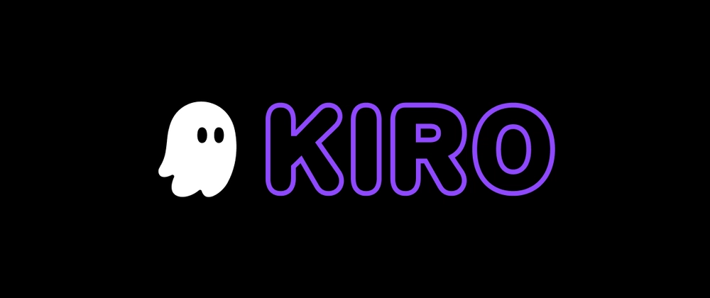
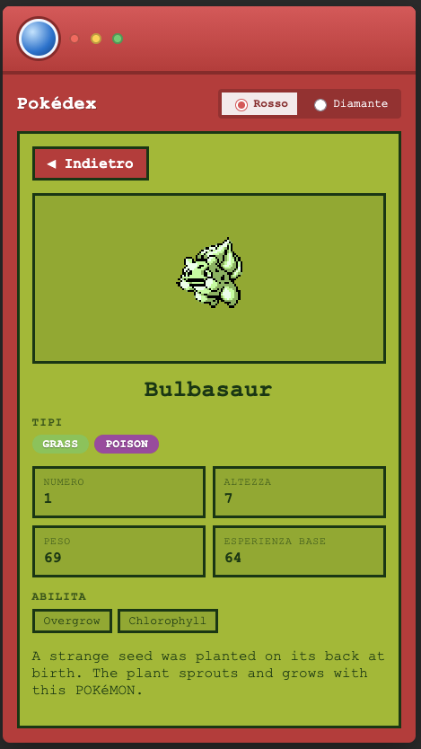

<h1 align="center">
  
  Workshop Kiro IDE · Pokédex FrontEnd
  
</h1>

<p align="center">
  
  &nbsp;&nbsp;&nbsp;
  
  &nbsp;&nbsp;&nbsp;
  
</p>

<p align="center">
  Materiale del workshop <strong>Kiro IDE</strong> presentato all'
  <a href="https://www.pignolalug.it/iniziative/ide-battle-come-to-code-ai-dev-workflow/"><strong>IDE Battle @ Come To Code</strong></a>
  — AI &amp; Dev Workflow<br>
  Organizzato da <a href="https://www.pignolalug.it/">PignolaLUG</a> · Venerdì 25 settembre 2026, 16:00–19:00
</p>

<p align="center">
  
</p>

Questo è il materiale della sessione dedicata a **Kiro IDE**, uno dei tre IDE
AI-native messi a confronto all'IDE Battle. Qui quel
progetto è un **Pokédex FrontEnd** (React + Vite + TypeScript) che pesca i dati dalle
[PokéAPI](https://pokeapi.co/). Il Pokédex in sé conta poco: serve da pretesto
per vedere all'opera tre cose che Kiro sa fare bene.

- 📋 **Spec-driven development** — dai requisiti al design ai task.
- 🧭 **Steering files** — le convenzioni di progetto le scrivi una volta sola.
- ⚡ **Agent Hooks** — automazioni che scattano sugli eventi dell'IDE.

Andiamo **a step**, e ogni step è un commit con il suo tag (`step-N-slug`). Se
sei a corto di crediti, questo ti torna comodo: puoi fare `git checkout` a un
punto qualsiasi della storia e ripartire da lì.

---

## Come usare questo tutorial

Il modo più semplice è seguire gli step in ordine. Ognuno riparte da dove
finisce il precedente e aggiunge un pezzo alla storia. Dentro trovi comandi,
snippet e prompt già pronti da copiare, così puoi rifare da te quello che ha
fatto l'agente senza stare a indovinare.

Non devi per forza partire dall'inizio, però. Visto che ogni step è un commit
con il suo tag (`step-N-slug`), puoi saltare dritto al punto che ti interessa:
`git checkout step-8-redesign-ui` e sei lì.

Anzi, muoviti pure avanti e indietro tra i commit per provare le cose che ti
incuriosiscono. Fai `git checkout` del tag, avvia l'app o i test, guardati
attorno, e quando vuoi salti da un'altra parte. La storia è fatta apposta per
essere esplorata così: ogni tag lascia il progetto in uno stato coerente, che
gira.

---

## Prerequisiti

- **Node.js** 18+ e **npm**
- **Git**
- **Kiro IDE** (vedi installazione qui sotto)
- Connessione a internet (per le PokéAPI)

### Installare Kiro

Kiro si scarica dalla pagina ufficiale, che ha l'installer per ogni sistema
operativo:

- **Pagina download (tutti gli OS):** <https://kiro.dev/downloads/>
  - **macOS** — installer per Intel e Apple Silicon
  - **Windows** — installer x64
  - **Linux** — pacchetto `.deb` (Debian/Ubuntu) o tarball universale
- **Guida ufficiale all'installazione:** <https://kiro.dev/docs/getting-started/installation/>

Prendi quello del tuo sistema e installalo come faresti con qualsiasi altra app.

### Account e crediti

Non serve un account AWS. Al primo avvio accedi con GitHub, Google, AWS Builder
ID o AWS IAM Identity Center (<https://app.kiro.dev/>). Il **piano gratuito**
ti dà **50 crediti** e basta per il workshop.

La [documentazione di Kiro](https://kiro.dev/docs/billing/related-questions/)
definisce così un credito:

> A credit is a unit of work in response to user prompts.

In altre parole, un credito misura il lavoro che l'agente fa per rispondere a un
tuo prompt. Il consumo è **frazionario**: si scala in base a ogni richiesta, a
incrementi di 0,01 credito. Da cosa dipende quanto spendi:

- **Complessità della richiesta.** Modifiche brevi e prompt corti costano meno
  di un credito; un task più impegnativo, come eseguire un task di una spec, di
  solito ne costa più di uno.
- **Modello scelto.** Modelli diversi consumano a ritmi diversi: uno potente
  come Opus costa più crediti di Auto a parità di richiesta.
- **Reasoning effort.** Regola quanto il modello "ragiona": un effort più alto
  spende più token e quindi più crediti, uno più basso dà risposte più rapide ed
  economiche.

Per il workshop **consigliamo la modalità Auto**, che è anche quella di default.
Invece di fissare sempre un modello potente, Auto instrada ogni richiesta al
modello più adatto al compito: task leggeri vanno a modelli più veloci ed
economici, quelli impegnativi ai modelli più capaci, con fallback automatico per
non perdere in qualità. Il risultato è che consumi meno crediti a parità di
lavoro, che con 50 crediti a disposizione fa la differenza. Trovi i modelli
disponibili nella [doc sui modelli](https://kiro.dev/docs/models/).

I dettagli aggiornati stanno nella
[pagina billing](https://kiro.dev/docs/billing/) ufficiale.

---

## Steps

| # | Step | Cosa mostra di Kiro |
|--:|------|---------------------|
| 1 | [Steering di progetto](#step-1--steering-di-progetto) | 🧭 Steering files |
| 2 | [Progetto base React + TypeScript](#step-2--progetto-base-react--typescript-hello-world) | 🗺️ Plan mode |
| 3 | [Client PokéAPI](#step-3--client-pokéapi-spec-pokeapi-client-tdd) | 📋 Spec-driven |
| 4 | [Toolchain ESLint + Prettier](#step-4--toolchain-di-qualità-eslint--prettier-zero-warning) | 🧭 Steering guida il tooling |
| 5 | [Test in cartella separata](#step-5--test-in-una-cartella-separata) | 🧭 Steering vivo |
| 6 | [Ambiente test componenti](#step-6--ambiente-di-test-dei-componenti-jsdom--testing-library) | 📋 Task di config di una spec |
| 7 | [Viste + temi](#step-7--feature-pokedex-themed-views-le-due-viste-e-i-temi-tdd) | 📋 Spec-driven |
| 8 | [Redesign UI](#step-8--redesign-ui-un-vero-pokédex-sprite--badge-tipo) | 🎨 Iterazione visiva |
| 9 | [Hook: formatta al salvataggio](#step-9--agent-hook-formatta-e-controlla-al-salvataggio) | ⚡ Hook `command` |
| 10 | [Cattura dei Pokémon](#step-10--feature-pokemon-capture-toggle-cattura-dei-pokémon-tdd) | 📋 Spec-driven |
| 11 | [Hook: affina il prompt](#step-11--agent-hook-affina-il-prompt-prima-di-eseguire) | ⚡ Hook `agent` |
| 12 | [Sprite dipendenti dal tema](#step-12--sprite-dipendenti-dal-tema-rossoblu-e-diamanteperla-tdd) | 🧭 Steering vivo |

---

### Step 1 · Steering di progetto

> 🧭 **Cosa mostra di Kiro** · Gli **steering files** in `.kiro/steering/`: di
> default sempre inclusi nel contesto, così Kiro rispetta le tue regole senza
> che tu debba ripeterle a ogni messaggio.

**In breve** · Le convenzioni del progetto le insegniamo a Kiro una volta sola,
con i file di steering. Da qui in avanti valgono a ogni interazione, senza
ripeterle.

Creiamo sette file di convenzioni in `.kiro/steering/`:

| File | Ruolo |
|------|-------|
| `product.md` | Cos'è il Pokédex, obiettivi del workshop, scope |
| `tech.md` | Stack tecnologico, comandi build/test/lint |
| `workflow-tdd.md` | Modalità TDD: Red → Green → Refactor |
| `code-style.md` | Airbnb, TypeScript strict, zero warning |
| `structure.md` | Organizzazione di cartelle e file |
| `git-workshop.md` | Commit a step, history navigabile |
| `readme-tutorial.md` | Regola: tenere il README aggiornato come tutorial |

Gli steering vivono in `.kiro/steering/*.md` e sono attivi **di default**. In
alternativa possono essere condizionali (`inclusion: fileMatch`), manuali
(`inclusion: manual`, richiamabili con `#`) o automatici (`inclusion: auto`).

💬 **Prompt per Kiro**

> Definiamo dei file di steering sensati: TDD come modalità di sviluppo
> (prima i test, li facciamo fallire, poi implementiamo); stile Airbnb, no
> warning, TypeScript strict; più altri file utili al progetto.

---

### Step 2 · Progetto base React + TypeScript (Hello World)

> 🗺️ **Cosa mostra di Kiro** · La **plan mode**: l'agente non modifica nulla,
> ragiona e produce un piano che tu rivedi e approvi prima dell'esecuzione.

**In breve** · Creiamo lo scheletro minimo di un'app React + TypeScript con
Vite che mostra un "Hello World", avviabile con `npm run dev`. Nessuna logica
ancora.

Kiro lavora in due modi. In **Vibe / esecuzione** agisce subito: scrive file,
lancia comandi. In **plan mode** invece si ferma un attimo, legge il codice e
propone un piano (obiettivo, scelte tecniche, task) che tu approvi prima che
tocchi qualcosa. Il bello è che allinei le idee *prima* di scrivere codice, così
si rifà meno lavoro. E il piano resta un documento di discussione: lo cambi a
costo quasi zero. Dal vivo, poi, si vede ragionare l'agente, non solo il
risultato finale.

Dal piano approvato Kiro genera lo scaffold e lo riduce a un "Hello World". Il
codice che ne esce conta poco. Quello che ci interessa mostrare è l'agente che
prende un piano condiviso e lo trasforma in un progetto che parte, chiedendo
conferma dove serve.

> Qui abbiamo pianificato in chat. Dallo **Step 3** facciamo un passo in più con
> lo **spec-driven development**: il piano diventa un artefatto versionato in
> `.kiro/specs/` (requirements → design → tasks).

✅ **Risultato atteso** · Avviando `npm run dev` si apre la pagina "Hello World"
del workshop.

---

### Step 3 · Client PokéAPI (spec `pokeapi-client`, TDD)

> 📋 **Cosa mostra di Kiro** · Il primo giro completo di **spec-driven
> development**: `.kiro/specs/pokeapi-client/` con requirements → design → tasks,
> eseguiti uno a uno.

**In breve** · Costruiamo il livello che parla con le PokéAPI: tipi grezzi,
validazione, parsing, mapping verso i tipi di dominio, e un client con timeout e
gestione degli errori. È la base su cui poggia tutto il resto.

Lo steering `structure.md` è chiaro su un punto: solo il livello `api/` conosce la
forma grezza delle PokéAPI, il resto dell'app lavora con i nostri tipi di dominio.
Kiro applica la regola da sé, tenendo dentro `src/api/` tutto ciò che tocca la
rete. I criteri di correttezza del design diventano **property test** con
`fast-check`, e le chiamate di rete restano **mockate**: nei test niente rete
vera, come vuole lo steering.

💬 **Prompt per Kiro**

> Esegui i task della spec `pokeapi-client` in TDD: per ogni pezzo di logica
> prima i test rossi (con `fast-check` per le property), poi l'implementazione
> verde minima. Solo `api/` conosce la forma della rete; niente rete reale nei
> test.

> 👀 **Da osservare** · Mentre Kiro lavora, guarda come affronta i task a
> **wave**: prima quelli senza dipendenze, poi quelli che dipendono dai
> precedenti. Non procede a caso, ma segue l'ordine dettato dal grafo di
> dipendenze della spec. È il primo assaggio di come lo spec-driven trasforma un
> design in un piano di esecuzione ordinato.

**Risultato atteso** · I test del client `api/` passano tutti. Il modulo espone
un client con `list`, `get` e gestione di timeout/errori, lavorando su tipi di
dominio e non sulla forma grezza della rete.

> In questo step la toolchain di lint non è ancora configurata (arriva allo
> Step 4) e i test vivono ancora accanto al codice (si spostano in `__tests__/`
> allo Step 5).

---

### Step 4 · Toolchain di qualità: ESLint + Prettier (zero warning)

> 🧭 **Cosa mostra di Kiro** · Come gli **steering files** guidano le scelte di
> tooling: Kiro conosce già i vincoli (Airbnb + Prettier, strict, zero warning)
> e adatta la configurazione alla realtà del progetto.

**In breve** · Mettiamo su ESLint e Prettier e facciamo passare `npm run lint`
con zero warning, come chiedono gli steering `tech.md` e `code-style.md`.

Qui c'è un intoppo: lo steering vuole lo stile **Airbnb**, ma le config
`eslint-config-airbnb` non reggono il flat config di ESLint 9. Kiro non si
incaponisce sulla config legacy. Ragiona sul vincolo e ne ricostruisce lo spirito
con i building block ufficiali compatibili: regole JS/TS, plugin React e import,
e `eslint-config-prettier` in coda che lascia la formattazione a Prettier. Non
smonta le regole in blocco. Ne adatta giusto qualcuna, con una ragione precisa
(ordine degli import, dipendenze in test e config), e non lascia in giro
`eslint-disable`.

**Risultato atteso** · `lint`, `typecheck` e `test` passano tutti. I test
restano **137 passati su 18 file**; nessun warning di lint.

---

### Step 5 · Test in una cartella separata

> 🧭 **Cosa mostra di Kiro** · Che lo **steering è vivo**: quando cambia una
> convenzione, aggiorni `structure.md` e la nuova regola vale per ogni
> interazione futura, senza ripeterla.

**In breve** · Spostiamo i test dal fianco del codice a una cartella `__tests__/`
dedicata, tenendo tutto verde e aggiornando lo steering che descrive la struttura.

I file di test del modulo `api/` finiscono in `__tests__/`, e accanto al codice
restano solo i moduli di produzione. Kiro sistema gli import relativi e non tocca
la configurazione di raccolta dei test, che li pesca a qualunque profondità. Poi
aggiorna `structure.md`: la convenzione passa da "test accanto al codice" a "test
in `__tests__/`". Fa parte dello step, così la regola nuova vale da subito.

💬 **Prompt per Kiro**

> Prima di andare avanti sposta i test in una cartella separata e aggiorna lo
> steering della struttura. Poi aggiorna il README.

**Risultato atteso** · `lint`, `typecheck` e `test` passano tutti. I test restano
**137 passati su 18 file**; `src/api/` non contiene più file `.test.ts`.

---

### Step 6 · Ambiente di test dei componenti (jsdom + Testing Library)

> 📋 **Cosa mostra di Kiro** · Il primo task di una **spec**
> (`pokedex-themed-views`), di **configurazione** e non di logica: non richiede
> test scritti prima, il TDD scatta sui task di logica che seguono.

**In breve** · Prepariamo l'ambiente per testare i componenti React con React
Testing Library. Finora i test coprivano solo il client `api/`, che del DOM non
ha bisogno. Le viste sì.

È un task di configurazione, quindi Kiro installa le dipendenze di test (React
Testing Library, jsdom e i matcher di `jest-dom`), sposta l'ambiente Vitest da
`node` a `jsdom` e registra un file di setup. Nessun test scritto prima: qui non
serve.

**Risultato atteso** · I test girano in ambiente **jsdom** e quelli del client
`api/` restano verdi. Eventuali test rossi sui moduli non ancora implementati
(sprite, `generation`, `theme`) sono attesi: appartengono ai task TDD successivi
e diventeranno verdi passo dopo passo.

---

### Step 7 · Feature `pokedex-themed-views`: le due viste e i temi (TDD)

> 📋 **Cosa mostra di Kiro** · Lo **spec-driven development** fino in fondo: da
> `requirements.md` → `design.md` → `tasks.md`, Kiro esegue i task uno a uno
> rispettando gli steering (Airbnb, strict, test in `__tests__/`).

**In breve** · Implementiamo la feature completa: la **Vista_Elenco** (scroll
infinito sui primi 151 Pokémon), la **Vista_Dettaglio** e due **temi
commutabili** (Rosso in stile Game Boy, Diamante moderno), in TDD e sopra il
client PokéAPI esistente.

La spec spezza la feature in **16 task** con un grafo di dipendenze. Kiro sale
per livelli, dal basso: prima la logica pura (il filtro della Prima_Generazione,
la gestione del tema), poi gli hook che tengono insieme stato e fetch, poi i
componenti di presentazione, e in cima la composizione nelle viste con il wiring
in `App`. Per ogni pezzo di logica scrive prima i test rossi e poi
l'implementazione minima che li fa passare, con i criteri del design tradotti in
**property test** su `fast-check`.

Qui si vedono due cose insieme. L'agente rispetta i confini dello steering: solo
`api/` conosce la rete, i componenti restano "stupidi", il client viene iniettato
e nei test è mockato. E segue il ciclo Red-Green senza che tu debba stargli
dietro a ricordarglielo.

💬 **Prompt per Kiro**

> Esegui i task della spec `pokedex-themed-views` in TDD: per ogni pezzo di
> logica prima i test rossi (con `fast-check` dove servono le property), poi
> l'implementazione verde minima. Client PokéAPI sempre mockato, niente rete
> reale.

**Risultato atteso** · Tutto verde: **243 test passati su 34 file**, lint a zero
warning. Con `npm run dev` navighi l'elenco dei primi 151 Pokémon, apri il
dettaglio e commuti tra Tema_Rosso e Tema_Diamante dal Selettore_Tema.

---

### Step 8 · Redesign UI: un vero Pokédex (sprite + badge tipo)

> 🎨 **Cosa mostra di Kiro** · Un ciclo di **iterazione visiva** guidato da un
> prompt in linguaggio naturale ("il CSS fa schifo, sistemalo"), mantenendo
> intatti i vincoli degli steering: TDD sulla logica nuova, test/lint/typecheck
> verdi, confini rispettati.

**In breve** · Diamo all'app l'aspetto di un vero Pokédex: scocca del dispositivo
(lente blu, LED), miniature degli sprite nell'elenco, badge dei tipi colorati nel
dettaglio, layout completo per entrambi i temi.

Possiamo riscrivere la UI senza rompere niente perché i test dei componenti
guardano il **comportamento osservabile** (ruoli ARIA, testo, ordine), non le
classi CSS. Finché numero, nome, tipi e abilità restano nel documento con i ruoli
giusti, i 247 test reggono. L'unica **logica nuova** è l'URL dello sprite
ricavato dal solo id, senza sparare 151 richieste di dettaglio, e quella nasce in
TDD dai test rossi. Tutto il resto è pura presentazione: la scocca decorativa, i
badge colorati con la palette ufficiale, e i ritocchi fatti via CSS in modo da non
toccare i nodi di testo su cui i test fanno match.

> I **tipi** restano nascosti nell'elenco (come nel Pokédex originale: lista =
> numero + nome + sprite) e compaiono nel dettaglio. I due temi acquistano
> identità: **Rosso** in stile Game Boy (schermo verde a 4 tonalità, font pixel,
> sprite duotone) e **Diamante** moderno (superfici chiare, ombre morbide, badge
> visibili anche in lista).

💬 **Prompt per Kiro**

> Il CSS fa abbastanza schifo. Trova degli screenshot, capisci com'è fatto un
> vero Pokédex e sistema quello e il rendering in generale.

**Risultato atteso** · Tutto verde. Con `npm run dev` l'app appare dentro la
scocca di un Pokédex: elenco con le miniature, dettaglio con sprite grande,
statistiche e badge dei tipi colorati, e il Selettore_Tema che commuta tra
l'estetica Game Boy (Rosso) e quella moderna (Diamante).

---

### Step 9 · Agent Hook: formatta e controlla al salvataggio

> 🎯 **Cosa mostra di Kiro** · Gli **Agent Hooks**: un'azione legata a un evento
> dell'IDE. Qui un'azione `command` sul trigger `PostFileSave`.

**In breve** · Ogni volta che salvi un file `.ts`/`.tsx`, Kiro lo formatta con
Prettier e lo controlla con ESLint a zero warning. Solo su quel file, e senza che
tu tocchi il terminale.

La tentazione sarebbe far girare i test a ogni salvataggio, ma con una suite che
cresce diventa lento e appesantisce la demo dal vivo. Formattazione e lint sul
singolo file sono quasi istantanei, e beccano subito i problemi più frequenti:
stile fuori posto ed errori di lint. Lo stile lo decide Prettier, lo steering
vuole zero warning, e l'hook fa rispettare tutte e due le regole proprio mentre
scrivi. I test restano un passo che fai apposta, non un ronzio di sottofondo.

Non scrivi il file a mano: in Kiro apri la sezione **Agent Hooks** (feature
panel) o la command palette → **"Open Kiro Hook UI"**, descrivi cosa vuoi, e Kiro
genera il JSON in `.kiro/hooks/`.

💬 **Prompt per Kiro**

> Crea un agent hook che, al salvataggio di un file `.ts`/`.tsx`, formatti quel
> file con Prettier e cerchi errori con ESLint (zero warning). Solo sul file
> salvato: niente test, deve restare leggero.

📄 **Il file generato** · `.kiro/hooks/format-and-lint-on-save.json`

```json
{
  "version": "v1",
  "hooks": [
    {
      "name": "Formatta e controlla al salvataggio",
      "trigger": "PostFileSave",
      "description": "Al salvataggio di un file .ts o .tsx formatta il file con Prettier e cerca errori con ESLint (zero warning), solo su quel file. Feedback rapido e leggero, senza eseguire i test.",
      "matcher": "\\.(ts|tsx)$",
      "action": {
        "type": "command",
        "command": "f=$(jq -r '.filePath // .file // empty'); [ -n \"$f\" ] && npx prettier --write \"$f\" && npx eslint --max-warnings=0 \"$f\""
      }
    }
  ]
}
```

**Come funziona** · Il trigger `PostFileSave` scatta a ogni salvataggio; il
`matcher` filtra solo i file `.ts`/`.tsx`; l'azione `command` riceve su stdin un
JSON con il path del file salvato (estratto con `jq`), lo formatta con Prettier e
poi lo passa a ESLint trattando i warning come errori. Se ESLint trova problemi,
esce con codice diverso da zero e l'hook segnala l'errore.

> `jq` è preinstallato su molti sistemi (incluso macOS recente). Se non ce l'hai:
> `brew install jq`.

🧪 **Provalo** · Con l'hook attivo, apri un file (es. `src/lib/generation.ts`),
sporca la formattazione e aggiungi un `console.log`, poi salva: Kiro riformatta e
segnala l'errore di lint (`no-console`). Togli il `console.log`, salva di nuovo, e
il file torna pulito. La stessa catena a mano dal terminale:

```bash
npx prettier --write src/lib/generation.ts && npx eslint --max-warnings=0 src/lib/generation.ts
```

---

### Step 10 · Feature `pokemon-capture-toggle`: cattura dei Pokémon (TDD)

> 📋 **Cosa mostra di Kiro** · Lo **spec-driven development** end-to-end
> (`.kiro/specs/pokemon-capture-toggle/`) e lo **steering vivo** applicato senza
> ripeterlo (Airbnb, confini di `api/`).

**In breve** · Aggiungiamo la cattura dei Pokémon: ogni voce dell'elenco ha una
**Poké Ball** che accende/spegne la cattura con un'animazione, lo stato è
**persistito** in `localStorage` e sopravvive al refresh, e nel dettaglio di un
Pokémon catturato compare la **Descrizione_Pokedex**.

La spec spezza la feature in una trentina di task, ordinati per **wave** di
dipendenze. Kiro parte dal **core puro**: funzioni pure e immutabili per
catturare, rilasciare e serializzare, idempotenti e senza toccare DOM, storage o
rete. È il punto migliore da cui aprire il ciclo TDD. Da lì sale verso il wiring,
cioè il Context di persistenza con **storage iniettabile** (in produzione
`localStorage`, nei test un fake deterministico), il componente Toggle e il gating
della descrizione. Su quelle funzioni si aggancia la **Property 3
(idempotenza)**: catturare due volte lo stesso Pokémon deve dare lo stesso
risultato di una cattura sola. L'animazione la testiamo con **fake timers**, così
i test non dipendono dai tempi reali. E anche qui il confine tiene: la nuova
chiamata di rete `getSpecies` sta solo in `api/`, e la descrizione la chiediamo
soltanto se il Pokémon è catturato.

💬 **Prompt per Kiro**

> Esegui i task della spec `pokemon-capture-toggle` in TDD: per ogni pezzo di
> logica prima i test rossi (con `fast-check` per le property; la Property 3
> sull'idempotenza è obbligatoria), poi l'implementazione verde minima. Storage
> iniettabile, client PokéAPI mockato, animazione testata con fake timers.

**Risultato atteso** · Tutto verde: **337 test passati su 40 file**, lint a zero
warning. Con `npm run dev` catturi un Pokémon dall'elenco (la Poké Ball si accende
con l'animazione), la cattura **sopravvive al refresh**, e il dettaglio di un
Pokémon catturato mostra la **Descrizione_Pokedex**.

---

### Step 11 · Agent Hook: affina il prompt prima di eseguire

> ⚡ **Cosa mostra di Kiro** · Un secondo tipo di **Agent Hook**: a differenza
> dello Step 9 (azione `command`), qui un'azione `agent` sul trigger
> `UserPromptSubmit` **inietta un prompt statico** nel contesto del modello a
> ogni invio, senza eseguire comandi di shell.

**In breve** · A ogni messaggio inviato all'agente, Kiro elabora e raffina la
richiesta quando non è chiara, ponendo domande a scelta multipla prima di agire.
Migliora la qualità dell'interazione senza cambiare il codice del progetto.

Le due azioni si completano. La `command` esegue shell, e va bene per gli effetti
collaterali o i controlli esterni come format e lint (lo Step 9). La `agent`
aggiunge invece un prompt statico al contesto, ed è quella giusta per orientare
il comportamento del modello. Il trigger `UserPromptSubmit` scatta a ogni
messaggio, prima che l'agente parta: il momento perfetto per raffinare la
richiesta. Come nello Step 9, l'hook lo crei dalla sezione **Agent Hooks** o dalla
command palette, non a mano.

💬 **Prompt per Kiro**

> Crea un agent hook che, a ogni prompt che invio, elabori e raffini la mia
> richiesta se non è chiara, ponendo domande a scelta multipla prima di agire.

📄 **Il file generato** · `.kiro/hooks/affina-prompt.json`

```json
{
  "version": "v1",
  "hooks": [
    {
      "name": "Affina prompt",
      "trigger": "UserPromptSubmit",
      "action": {
        "type": "agent",
        "prompt": "Elabora e raffina il prompt dell'utente se non chiaro. In caso poni domande a scelta multipla"
      },
      "enabled": true
    }
  ]
}
```

**Come funziona** · Il trigger `UserPromptSubmit` scatta a ogni messaggio, prima
che l'agente cominci; l'azione `agent` appende il `prompt` indicato al contesto
del modello per quel turno, chiedendo chiarimenti quando la richiesta è ambigua.
A differenza dell'hook `command` (che riceve su stdin il contesto della
sessione), l'azione `agent` non ha input dinamico: aggiunge sempre lo stesso
testo. È il modo più semplice per condizionare il comportamento dell'agente.

🧪 **Provalo** · Con l'hook attivo, invia una richiesta volutamente vaga (es.
"sistema gli sprite"): Kiro, prima di agire, chiede chiarimenti con opzioni a
scelta multipla, poi procede solo dopo la tua risposta.

---

### Step 12 · Sprite dipendenti dal tema (Rosso/Blu e Diamante/Perla) (TDD)

> 🧭 **Cosa mostra di Kiro** · Lo **steering vivo**: la logica di costruzione
> dell'URL resta pura in `lib/`, i componenti restano "stupidi" e ricevono il
> tema via prop, nessuno conosce la forma della rete.

**In breve** · Lo sprite mostrato **dipende dal tema selezionato**: tema Rosso →
sprite di Rosso/Blu, tema Diamante → sprite di Diamante/Perla. È un'evoluzione
dello Step 8: qui la scelta diventa dinamica e vive nella presentazione, con
l'URL derivabile dal solo id senza fetch aggiuntivi.

Gli sprite per-gioco delle PokéAPI hanno un URL prevedibile: basta l'id e il gioco
che corrisponde al tema. Kiro parte dai **test rossi** su una funzione pura nuova
che, dati id e tema, tira fuori l'URL giusto, e poi scrive l'implementazione
minima per farli passare. L'integrazione resta tutta nella presentazione: i
componenti ricevono il tema via prop e, se lo sprite di quel gioco non c'è,
ripiegano su quello generico; le viste leggono il tema attivo dal loro hook.

💬 **Prompt per Kiro**

> Fai sì che gli sprite dei Pokémon corrispondano al gioco del tema selezionato:
> tema Rosso → sprite Rosso/Blu, tema Diamante → sprite Diamante/Perla. In TDD.

**Risultato atteso** · Tutto verde: **344 test passati su 40 file**, lint a zero
warning. Con `npm run dev`, appena cambi tema gli sprite passano dalla pixel-art
di Rosso/Blu (Gen I) a quella di Diamante/Perla (Gen IV). Per i Pokémon che in
quel gioco non hanno uno sprite, si ripiega da solo su quello generico.
